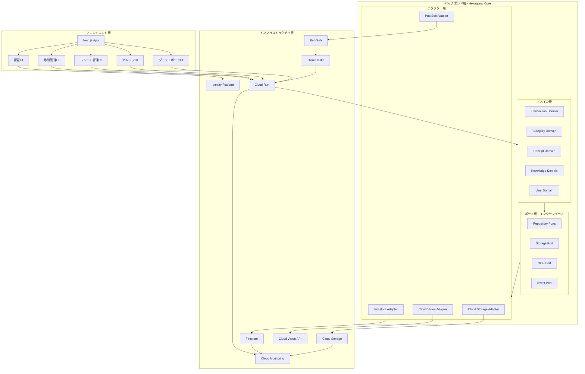
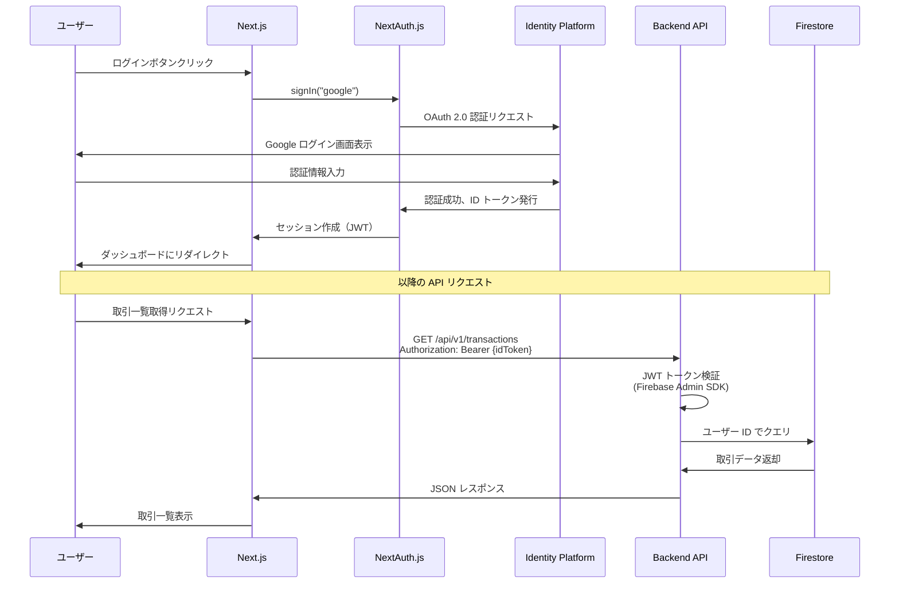
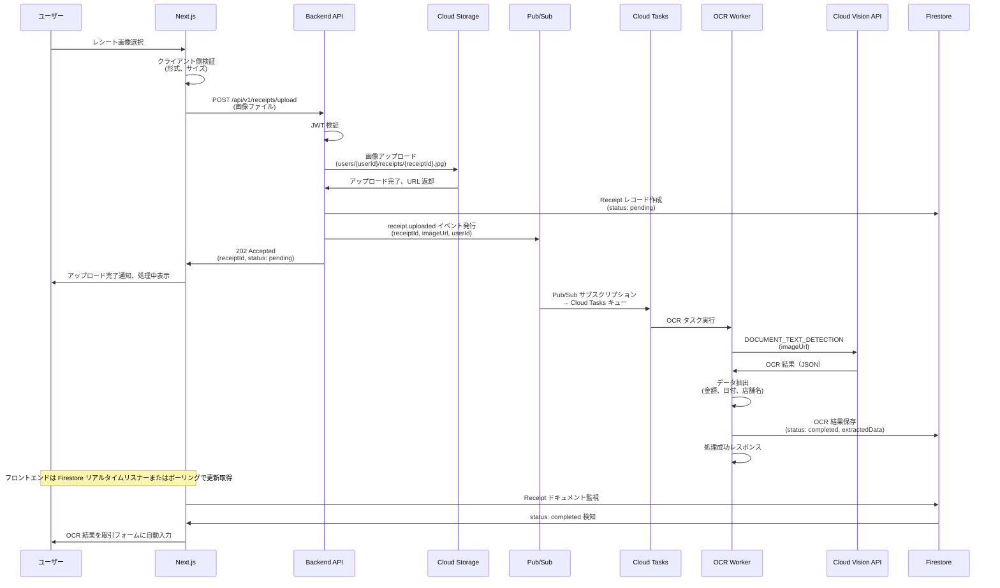
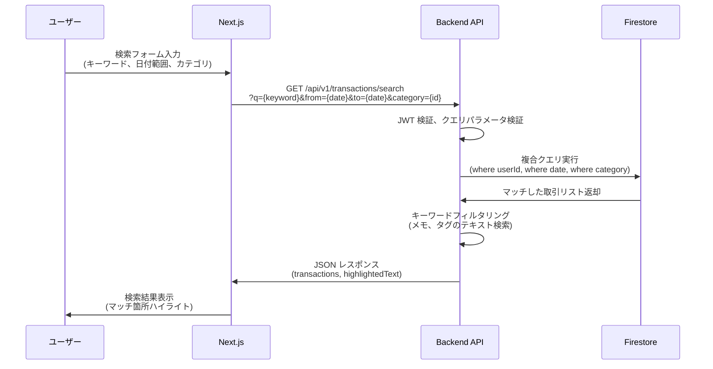
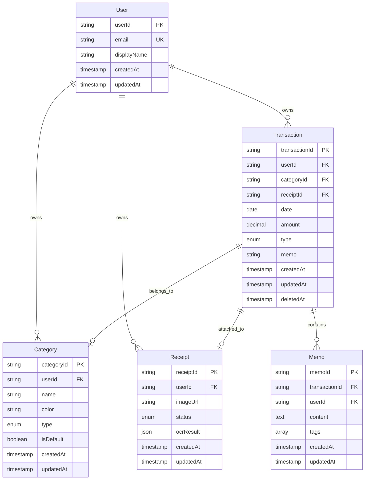
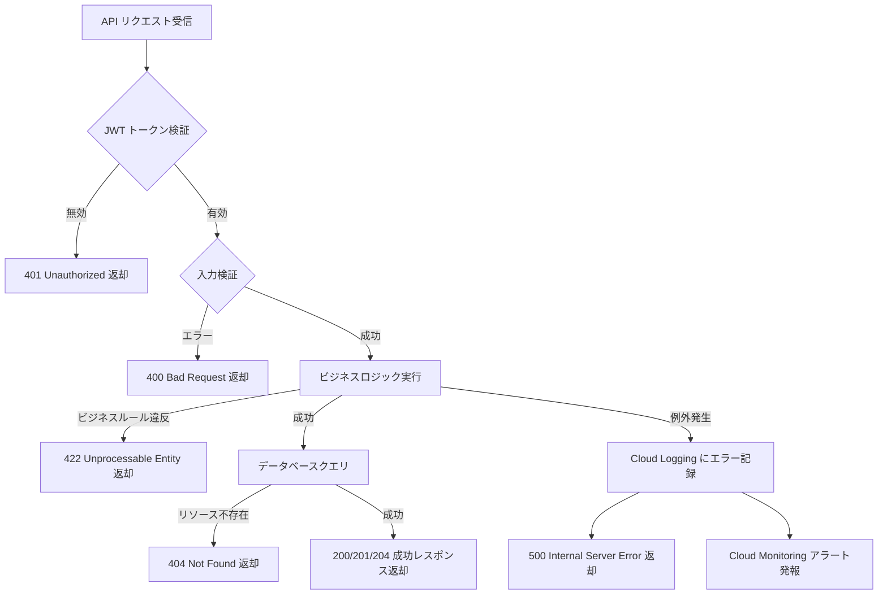
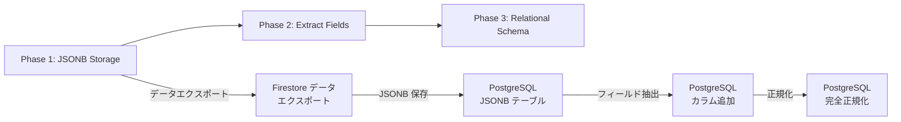

# 技術設計書 - Ledger Muse

## Overview

Ledger Muse は、Google Cloud 上で動作する家計簿管理 Web アプリケーションです。個人利用から将来的な商用展開までをカバーする拡張可能なアーキテクチャを採用し、収支管理、レシート画像 OCR、ナレッジ管理（メモ・検索）機能を統合します。

**ユーザー**: 個人ユーザーが日常的な収支記録、レシート画像のアップロード、メモ追加、検索、集計レポートの確認を行います。将来的には商用プラン（マルチテナント、有料機能）への拡張を想定しています。

**影響**: 本プロジェクトは新規構築（greenfield）であり、既存システムの変更は伴いません。Google Cloud の各種マネージドサービス（Identity Platform、Cloud Run、Firestore、Cloud Storage、Cloud Vision API、Pub/Sub、Cloud Tasks）を活用し、低コストで開始しつつ、将来的な商用運用に対応できる設計を実現します。

### Goals
- Google Cloud 上で動作する家計簿 Web アプリの構築（認証、収支管理、レシート OCR、メモ・検索機能）
- Hexagonal Architecture による保守性・拡張性の高い設計
- 学習目的かつ低コスト運用（月数ドル〜数十ドル）
- 将来的な商用運用への移行可能性（Firestore → Cloud SQL PostgreSQL、マルチテナント対応）
- Terraform による Infrastructure as Code（dev/staging/prod 環境分離）

### Non-Goals
- 本設計フェーズでの実装コード作成（設計のみ）
- 銀行 API 連携や AI による高度な分析機能（将来拡張として記載）
- モバイルアプリ（iOS/Android ネイティブ）の開発（Web レスポンシブ対応のみ）
- リアルタイム協調編集機能（将来的な商用機能として検討）

## Architecture

本設計は `research.md` に記録された調査結果に基づき、Hexagonal Architecture（ポート＆アダプターパターン）を採用します。詳細な技術調査、代替案の比較、外部依存関係の検証は `research.md` を参照してください。

### Existing Architecture Analysis

本プロジェクトは新規構築（greenfield）のため、既存アーキテクチャとの統合は不要です。ただし、将来的な商用運用を見据えた拡張性を設計に組み込みます。

### Architecture Pattern & Boundary Map

**選択パターン**: Hexagonal Architecture（ポート＆アダプター）+ Clean Architecture の概念

**ドメイン境界**:
- **Transactions（取引）**: 収入・支出の記録、編集、削除、集計
- **Categories（カテゴリ）**: カテゴリの作成、編集、削除、取引への関連付け
- **Receipts（レシート）**: 画像アップロード、OCR 処理、結果の関連付け
- **Knowledge（ナレッジ）**: メモ追加、タグ管理、検索機能
- **Users（ユーザー）**: 認証、アカウント管理、権限制御

**ポート（インターフェース）**:
- Repository ポート: TransactionRepository, CategoryRepository, ReceiptRepository, KnowledgeRepository, UserRepository
- Storage ポート: ImageStorage
- OCR ポート: OCRService
- Event ポート: EventPublisher

**アダプター（実装）**:
- Firestore アダプター: 各 Repository の Firestore 実装
- Cloud Storage アダプター: ImageStorage の Cloud Storage 実装
- Cloud Vision アダプター: OCRService の Cloud Vision API 実装
- Pub/Sub アダプター: EventPublisher の Pub/Sub 実装

**既存パターンの保持**: 新規プロジェクトのため該当なし

**新規コンポーネントの根拠**:
- Hexagonal Architecture により、ドメインロジックとインフラストラクチャを分離
- 将来的な Firestore → PostgreSQL 移行時にアダプターのみ交換可能
- テスト容易性向上（モックポートで単体テスト）

**Steering 準拠**: 学習目的かつ将来的な商用化を見据えた設計、安定技術の採用、コスト管理



### Technology Stack

| Layer | Choice / Version | Role in Feature | Notes |
|-------|------------------|-----------------|-------|
| **Frontend** | Next.js 15.x (TypeScript) | Web UI, SSR/SSG, API Routes | App Router 使用、レスポンシブデザイン対応 |
| **Frontend Auth** | NextAuth.js (Auth.js) v5.x | Google OAuth 認証、セッション管理 | Identity Platform 統合、JWT セッション |
| **Backend** | Go 1.23.x + Echo v4.x | REST API、ビジネスロジック | Cloud Run デプロイ、Hexagonal Architecture 実装 |
| **Backend Auth** | Firebase Admin SDK (Go) v4.x | JWT トークン検証 | echo-middleware-firebasejwt 使用 |
| **Database (初期)** | Firestore (Native Mode) | ドキュメントストア | 無料枠活用、将来的に PostgreSQL 移行 |
| **Database (将来)** | Cloud SQL PostgreSQL 16.x | リレーショナル DB | JSONB サポート、ACID トランザクション |
| **Storage** | Cloud Storage Standard Class | レシート画像保存 | サーバー側暗号化、ライフサイクルポリシー |
| **OCR** | Cloud Vision API | レシート OCR 処理 | DOCUMENT_TEXT_DETECTION モード |
| **Messaging** | Pub/Sub | イベント駆動アーキテクチャ | receipt.uploaded イベント発行 |
| **Async Processing** | Cloud Tasks | OCR ワーカー管理 | レート制限、リトライ制御 |
| **Infrastructure** | Terraform v1.9.x | IaC、環境分離 | dev/staging/prod 分離管理 |
| **CI/CD** | Cloud Build | 自動ビルド・デプロイ | ユニットテスト・E2E テスト自動実行 |
| **Monitoring** | Cloud Monitoring + Logging + Trace | メトリクス収集、ログ管理、トレース | 構造化ログ（JSON）、分散トレーシング |
| **Security** | Cloud Armor (将来) | WAF、DDoS 対策 | 商用運用時に導入 |

**選定根拠**:
- **Next.js**: 2025 年時点で最も人気のある React フレームワーク、TypeScript フルサポート、SSR/SSG による SEO 対応
- **Echo**: Go の Web フレームワークで 16% の採用率、Gin より構造化されており中規模 API に適合
- **Firestore → PostgreSQL**: 学習段階では低コスト（無料枠）、将来的にリレーショナル機能（複雑な JOIN、トランザクション）が必要になった際に移行
- **Pub/Sub + Cloud Tasks**: イベント駆動（拡張性）とレート制御（Vision API クォータ管理）の両立
- **Terraform**: 2025 年のベストプラクティスは環境別ディレクトリ分離（ワークスペースではなく）

詳細な技術調査、代替案の比較、ベンチマーク結果は `research.md` の「Architecture Pattern Evaluation」および「Design Decisions」セクションを参照してください。

## System Flows

### ユーザー認証フロー



**フロー決定事項**:
- NextAuth.js が OAuth フロー、セッション管理を担当
- ID トークンは Authorization ヘッダーで Backend API に送信
- Backend は Firebase Admin SDK でトークン検証、ユーザー ID 抽出
- セッションは JWT 形式で保存（デフォルト 30 日間有効）

### レシート画像アップロード & OCR 処理フロー



**フロー決定事項**:
- 非同期処理により API レスポンスタイムを短縮（30 秒以内の OCR 処理時間を非ブロッキング化）
- Pub/Sub でイベント発行（将来的にサムネイル生成などの追加サブスクライバーを容易に追加可能）
- Cloud Tasks でレート制限（Vision API クォータ管理）
- Firestore リアルタイムリスナーで UI 更新（WebSocket 不要）
- OCR 失敗時はデッドレターキューに移動、アラート発報

### 取引検索フロー



**フロー決定事項**:
- Firestore の複合インデックスで日付・カテゴリフィルタを高速化
- テキスト検索（キーワード）はアプリケーション層で実装（Firestore はフルテキスト検索非対応）
- 将来的に BigQuery へのデータエクスポートで高度な検索・分析機能を追加可能

## Requirements Traceability

本セクションでは、各要件が設計のどのコンポーネント、インターフェース、フローで実現されるかを追跡します。

| Requirement | Summary | Components | Interfaces | Flows |
|-------------|---------|------------|------------|-------|
| 1 | ユーザー認証・アカウント管理 | AuthService, UserRepository | POST /api/v1/auth/signup, POST /api/v1/auth/login, POST /api/v1/auth/logout | ユーザー認証フロー |
| 2 | 収支記録の登録・管理 | TransactionService, TransactionRepository | POST /api/v1/transactions, GET /api/v1/transactions, PUT /api/v1/transactions/{id}, DELETE /api/v1/transactions/{id} | - |
| 3 | カテゴリ管理 | CategoryService, CategoryRepository | POST /api/v1/categories, PUT /api/v1/categories/{id}, DELETE /api/v1/categories/{id} | - |
| 4 | レシート画像アップロード | ReceiptService, ImageStorage | POST /api/v1/receipts/upload | レシート画像アップロード & OCR 処理フロー |
| 5 | レシート OCR 処理（非同期） | OCRWorker, OCRService, EventPublisher | Pub/Sub: receipt.uploaded イベント, Cloud Tasks: OCR ジョブ | レシート画像アップロード & OCR 処理フロー |
| 6 | ナレッジ管理（メモ機能） | KnowledgeService, KnowledgeRepository | POST /api/v1/transactions/{id}/memos, PUT /api/v1/transactions/{id}/memos/{memoId} | - |
| 7 | 検索機能 | SearchService, TransactionRepository, KnowledgeRepository | GET /api/v1/transactions/search | 取引検索フロー |
| 8 | 集計・レポート機能 | ReportService, TransactionRepository | GET /api/v1/reports/summary, GET /api/v1/reports/monthly | - |
| 9 | データベース設計・管理 | Firestore アダプター, PostgreSQL アダプター（将来） | Repository Ports 実装 | - |
| 10 | API 設計 | Echo Router, Middleware | RESTful API エンドポイント全体 | 全フロー |
| 11 | セキュリティ・認可 | JWTMiddleware, AuthorizationService | JWT 検証、ユーザーデータ隔離 | ユーザー認証フロー |
| 12 | インフラストラクチャ（Google Cloud） | Terraform Modules | Cloud Run, Firestore, Cloud Storage, Pub/Sub, Cloud Tasks | 全フロー |
| 13 | フロントエンド UI/UX | Next.js Pages/Components | UI コンポーネント（取引一覧、フォーム、ダッシュボード） | 全フロー |
| 14 | 拡張性・将来対応 | マルチテナント設計、モジュール化 | プラン管理、機能フラグ | - |
| 15 | 運用・監視 | LoggingMiddleware, MonitoringService | Cloud Logging, Cloud Monitoring, Cloud Trace | 全フロー |
| 16 | 技術選定基準 | - | - | - |
| 17 | Terraform によるインフラ構成管理 | Terraform Modules (network, compute, storage, iam) | terraform/environments/{dev,staging,prod}/ | - |
| 18 | 非同期処理アーキテクチャ | Pub/Sub アダプター, Cloud Tasks | EventPublisher Port, Cloud Tasks ジョブ | レシート画像アップロード & OCR 処理フロー |
| 19 | データ暗号化 | Cloud KMS, TLS 1.3 | HTTPS 通信、Cloud Storage 暗号化、Firestore 暗号化 | 全フロー |
| 20 | パフォーマンス・KPI | MonitoringService | Cloud Monitoring メトリクス（レスポンスタイム、エラー率） | - |
| 21 | コスト管理・最適化 | Billing Export, BigQuery | Cloud Billing アラート、リソースライフサイクルポリシー | - |

## Components and Interfaces

本セクションでは、各コンポーネントの責務、依存関係、契約（インターフェース）を定義します。

### コンポーネント概要

| Component | Domain/Layer | Intent | Req Coverage | Key Dependencies (Criticality) | Contracts |
|-----------|--------------|--------|--------------|-------------------------------|-----------|
| AuthService | Backend/Domain | ユーザー認証・認可 | 1, 11 | UserRepository (P0), Identity Platform (P0) | Service, API |
| TransactionService | Backend/Domain | 取引 CRUD、集計 | 2, 8 | TransactionRepository (P0), CategoryRepository (P1) | Service, API |
| CategoryService | Backend/Domain | カテゴリ CRUD | 3 | CategoryRepository (P0) | Service, API |
| ReceiptService | Backend/Domain | レシート管理 | 4, 5 | ReceiptRepository (P0), ImageStorage (P0), EventPublisher (P0) | Service, API, Event |
| KnowledgeService | Backend/Domain | メモ・タグ管理 | 6 | KnowledgeRepository (P0) | Service, API |
| SearchService | Backend/Domain | 取引検索 | 7 | TransactionRepository (P0), KnowledgeRepository (P1) | Service, API |
| OCRWorker | Backend/Worker | 非同期 OCR 処理 | 5, 18 | OCRService (P0), ReceiptRepository (P0) | Batch |
| FirestoreAdapter | Backend/Adapter | Firestore 実装 | 9 | Firestore SDK (P0) | Repository Ports 実装 |
| CloudStorageAdapter | Backend/Adapter | Cloud Storage 実装 | 4, 12 | Cloud Storage SDK (P0) | ImageStorage Port 実装 |
| CloudVisionAdapter | Backend/Adapter | Cloud Vision 実装 | 5 | Cloud Vision SDK (P0) | OCRService Port 実装 |
| PubSubAdapter | Backend/Adapter | Pub/Sub 実装 | 5, 18 | Pub/Sub SDK (P0) | EventPublisher Port 実装 |
| JWTMiddleware | Backend/Middleware | JWT トークン検証 | 11 | Firebase Admin SDK (P0) | Middleware |
| Next.js App | Frontend | Web UI、SSR/SSG | 13 | NextAuth.js (P0), Backend API (P0) | UI Components |

### Backend / Domain Layer

#### AuthService

| Field | Detail |
|-------|--------|
| Intent | ユーザー認証、アカウント管理、認可制御 |
| Requirements | 1, 11 |
| Owner / Reviewers | Backend Team |

**Responsibilities & Constraints**
- ユーザー登録、ログイン、ログアウト、パスワードリセットのビジネスロジック
- JWT トークンの検証はミドルウェアに委譲（AuthService は検証済みユーザー ID を受け取る）
- ユーザーデータの隔離（他ユーザーのデータへのアクセス拒否）
- トランザクション境界: ユーザー登録時に Firestore トランザクションでユーザードキュメント作成

**Dependencies**
- Inbound: Echo API Routes (POST /api/v1/auth/signup, POST /api/v1/auth/login) (P0)
- Outbound: UserRepository Port (P0)
- External: Google Cloud Identity Platform (P0), Firebase Admin SDK (P0)

**Contracts**: Service [x] / API [x] / Event [ ] / Batch [ ] / State [ ]

##### Service Interface

```typescript
interface AuthService {
  signUp(email: string, password: string): Result<User, AuthError>;
  signIn(email: string, password: string): Result<AuthToken, AuthError>;
  signOut(userId: string): Result<void, AuthError>;
  resetPassword(email: string): Result<void, AuthError>;
  verifyToken(token: string): Result<UserClaims, AuthError>;
}

interface UserClaims {
  userId: string;
  email: string;
  issuedAt: number;
  expiresAt: number;
}

type AuthError =
  | { type: 'INVALID_CREDENTIALS' }
  | { type: 'USER_NOT_FOUND' }
  | { type: 'ACCOUNT_LOCKED' }
  | { type: 'TOKEN_EXPIRED' }
  | { type: 'INTERNAL_ERROR'; message: string };
```

**Preconditions**:
- Email 形式が有効（RFC 5322 準拠）
- Password が最低 8 文字以上（Identity Platform のポリシーに準拠）

**Postconditions**:
- signUp 成功時、UserRepository にユーザーレコードが作成される
- signIn 成功時、有効な JWT トークンが返却される
- signOut 成功時、セッションが無効化される（クライアント側で削除）

**Invariants**:
- 同一メールアドレスでの重複登録を拒否
- ログイン失敗 5 回でアカウント一時ロック（Identity Platform のデフォルト動作）

##### API Contract

| Method | Endpoint | Request | Response | Errors |
|--------|----------|---------|----------|--------|
| POST | /api/v1/auth/signup | `{ email: string, password: string }` | `{ userId: string, email: string }` | 400 (バリデーション), 409 (重複), 500 |
| POST | /api/v1/auth/login | `{ email: string, password: string }` | `{ token: string, expiresAt: number }` | 400, 401 (認証失敗), 403 (ロック), 500 |
| POST | /api/v1/auth/logout | `{ userId: string }` | `{ success: true }` | 401, 500 |
| POST | /api/v1/auth/password-reset | `{ email: string }` | `{ success: true }` | 400, 404, 500 |

**Implementation Notes**
- Integration: NextAuth.js が Google OAuth フローを処理、Backend API は JWT 検証のみ実施（サインアップ/ログインは Identity Platform が管理）
- Validation: Email 形式検証、パスワード強度検証（最低 8 文字、大小英数字・記号混在推奨）
- Risks: Identity Platform の障害時に認証不可（Cloud Monitoring でアラート設定、ステータスページ提供）

---

#### TransactionService

| Field | Detail |
|-------|--------|
| Intent | 収支取引の作成、更新、削除、一覧取得、集計 |
| Requirements | 2, 8 |
| Owner / Reviewers | Backend Team |

**Responsibilities & Constraints**
- 取引レコードの CRUD 操作
- カテゴリとの関連付け、レシート画像との紐付け
- 月次・週次・日次集計の計算
- トランザクション境界: 取引作成・更新・削除は単一ドキュメント操作（Firestore）

**Dependencies**
- Inbound: Echo API Routes (POST /api/v1/transactions, GET /api/v1/transactions, PUT /api/v1/transactions/{id}, DELETE /api/v1/transactions/{id}) (P0)
- Outbound: TransactionRepository Port (P0), CategoryRepository Port (P1)
- External: なし

**Contracts**: Service [x] / API [x] / Event [ ] / Batch [ ] / State [ ]

##### Service Interface

```typescript
interface TransactionService {
  createTransaction(userId: string, data: CreateTransactionRequest): Result<Transaction, TransactionError>;
  updateTransaction(userId: string, transactionId: string, data: UpdateTransactionRequest): Result<Transaction, TransactionError>;
  deleteTransaction(userId: string, transactionId: string): Result<void, TransactionError>;
  getTransactions(userId: string, filter: TransactionFilter): Result<TransactionList, TransactionError>;
  getTransactionById(userId: string, transactionId: string): Result<Transaction, TransactionError>;
  getSummary(userId: string, period: Period): Result<TransactionSummary, TransactionError>;
}

interface CreateTransactionRequest {
  date: string; // ISO 8601 format
  amount: number;
  type: 'INCOME' | 'EXPENSE';
  categoryId: string;
  memo?: string;
  receiptId?: string;
}

interface UpdateTransactionRequest {
  date?: string;
  amount?: number;
  categoryId?: string;
  memo?: string;
}

interface Transaction {
  id: string;
  userId: string;
  date: string;
  amount: number;
  type: 'INCOME' | 'EXPENSE';
  categoryId: string;
  categoryName: string;
  categoryColor: string;
  memo?: string;
  receiptId?: string;
  receiptImageUrl?: string;
  createdAt: string;
  updatedAt: string;
  deletedAt?: string; // 論理削除
}

interface TransactionFilter {
  fromDate?: string;
  toDate?: string;
  categoryId?: string;
  type?: 'INCOME' | 'EXPENSE';
  limit?: number;
  offset?: number;
}

interface TransactionList {
  transactions: Transaction[];
  total: number;
  hasMore: boolean;
}

interface TransactionSummary {
  period: Period;
  totalIncome: number;
  totalExpense: number;
  balance: number;
  categoryBreakdown: CategorySummary[];
}

interface CategorySummary {
  categoryId: string;
  categoryName: string;
  categoryColor: string;
  total: number;
  percentage: number;
}

type Period = 'DAILY' | 'WEEKLY' | 'MONTHLY' | 'YEARLY';

type TransactionError =
  | { type: 'VALIDATION_ERROR'; field: string; message: string }
  | { type: 'TRANSACTION_NOT_FOUND' }
  | { type: 'CATEGORY_NOT_FOUND' }
  | { type: 'UNAUTHORIZED' }
  | { type: 'INTERNAL_ERROR'; message: string };
```

**Preconditions**:
- userId が有効（JWT 検証済み）
- date が ISO 8601 形式（YYYY-MM-DD）
- amount が正の数値
- categoryId が存在する

**Postconditions**:
- createTransaction 成功時、TransactionRepository に新規レコードが作成される
- updateTransaction 成功時、updatedAt フィールドが更新される
- deleteTransaction 成功時、deletedAt フィールドが設定される（論理削除）

**Invariants**:
- 取引は必ず userId に紐付く（他ユーザーのデータへのアクセス不可）
- 削除された取引（deletedAt != null）は一覧取得から除外される

##### API Contract

| Method | Endpoint | Request | Response | Errors |
|--------|----------|---------|----------|--------|
| POST | /api/v1/transactions | `CreateTransactionRequest` | `Transaction` | 400 (バリデーション), 404 (カテゴリ不存在), 401, 500 |
| GET | /api/v1/transactions | Query: `fromDate, toDate, categoryId, type, limit, offset` | `TransactionList` | 400, 401, 500 |
| GET | /api/v1/transactions/{id} | - | `Transaction` | 404, 401, 500 |
| PUT | /api/v1/transactions/{id} | `UpdateTransactionRequest` | `Transaction` | 400, 404, 401, 500 |
| DELETE | /api/v1/transactions/{id} | - | `{ success: true }` | 404, 401, 500 |
| GET | /api/v1/reports/summary | Query: `period, fromDate, toDate` | `TransactionSummary` | 400, 401, 500 |

**Implementation Notes**
- Integration: CategoryRepository から CategoryName/Color を取得して Transaction に含める（N+1 クエリ回避のためバッチ取得または JOIN 相当の処理）
- Validation: 日付形式、金額範囲（0 < amount < 1,000,000,000）、カテゴリ存在確認
- Risks: 大量取引データでのパフォーマンス低下（Firestore インデックス最適化、ページネーション必須）

---

#### CategoryService

| Field | Detail |
|-------|--------|
| Intent | カテゴリの作成、更新、削除、一覧取得 |
| Requirements | 3 |
| Owner / Reviewers | Backend Team |

**Responsibilities & Constraints**
- カテゴリレコードの CRUD 操作
- デフォルトカテゴリの初期登録（ユーザー作成時）
- カテゴリ削除時の取引チェック（使用中カテゴリの削除防止）
- トランザクション境界: カテゴリ作成・更新・削除は単一ドキュメント操作

**Dependencies**
- Inbound: Echo API Routes (POST /api/v1/categories, GET /api/v1/categories, PUT /api/v1/categories/{id}, DELETE /api/v1/categories/{id}) (P0)
- Outbound: CategoryRepository Port (P0), TransactionRepository Port (P1)
- External: なし

**Contracts**: Service [x] / API [x] / Event [ ] / Batch [ ] / State [ ]

##### Service Interface

```typescript
interface CategoryService {
  createCategory(userId: string, data: CreateCategoryRequest): Result<Category, CategoryError>;
  updateCategory(userId: string, categoryId: string, data: UpdateCategoryRequest): Result<Category, CategoryError>;
  deleteCategory(userId: string, categoryId: string): Result<void, CategoryError>;
  getCategories(userId: string, type?: 'INCOME' | 'EXPENSE'): Result<Category[], CategoryError>;
  getCategoryById(userId: string, categoryId: string): Result<Category, CategoryError>;
  initializeDefaultCategories(userId: string): Result<Category[], CategoryError>;
}

interface CreateCategoryRequest {
  name: string;
  color: string; // Hex color code (e.g., "#FF5733")
  type: 'INCOME' | 'EXPENSE';
}

interface UpdateCategoryRequest {
  name?: string;
  color?: string;
}

interface Category {
  id: string;
  userId: string;
  name: string;
  color: string;
  type: 'INCOME' | 'EXPENSE';
  isDefault: boolean;
  createdAt: string;
  updatedAt: string;
}

type CategoryError =
  | { type: 'VALIDATION_ERROR'; field: string; message: string }
  | { type: 'CATEGORY_NOT_FOUND' }
  | { type: 'CATEGORY_IN_USE'; transactionCount: number }
  | { type: 'UNAUTHORIZED' }
  | { type: 'INTERNAL_ERROR'; message: string };
```

**Preconditions**:
- name が非空文字列（1〜50 文字）
- color が有効な Hex カラーコード（正規表現: `^#[0-9A-Fa-f]{6}$`）
- type が 'INCOME' または 'EXPENSE'

**Postconditions**:
- createCategory 成功時、CategoryRepository に新規レコードが作成される
- deleteCategory 成功時、該当カテゴリが使用されていない場合のみ削除される

**Invariants**:
- カテゴリは必ず userId に紐付く
- デフォルトカテゴリ（isDefault: true）は削除不可

##### API Contract

| Method | Endpoint | Request | Response | Errors |
|--------|----------|---------|----------|--------|
| POST | /api/v1/categories | `CreateCategoryRequest` | `Category` | 400, 401, 500 |
| GET | /api/v1/categories | Query: `type` (optional) | `Category[]` | 401, 500 |
| GET | /api/v1/categories/{id} | - | `Category` | 404, 401, 500 |
| PUT | /api/v1/categories/{id} | `UpdateCategoryRequest` | `Category` | 400, 404, 401, 500 |
| DELETE | /api/v1/categories/{id} | - | `{ success: true }` | 404, 409 (使用中), 401, 500 |

**Implementation Notes**
- Integration: ユーザー登録時に initializeDefaultCategories を自動呼び出し（食費、交通費、給与などの初期カテゴリ作成）
- Validation: カテゴリ名重複チェック（同一 userId 内）、カラーコード形式検証
- Risks: カテゴリ削除時の取引チェックで N+1 クエリ発生リスク（TransactionRepository.countByCategory で集約）

---

#### ReceiptService

| Field | Detail |
|-------|--------|
| Intent | レシート画像のアップロード、OCR 処理トリガー、結果取得 |
| Requirements | 4, 5 |
| Owner / Reviewers | Backend Team |

**Responsibilities & Constraints**
- レシート画像の Cloud Storage アップロード
- Receipt レコードの作成（status: pending）
- Pub/Sub への receipt.uploaded イベント発行
- OCR 処理結果の取得・更新
- トランザクション境界: Receipt 作成と Pub/Sub 発行は単一トランザクションではない（結果整合性）

**Dependencies**
- Inbound: Echo API Routes (POST /api/v1/receipts/upload, GET /api/v1/receipts/{id}) (P0)
- Outbound: ReceiptRepository Port (P0), ImageStorage Port (P0), EventPublisher Port (P0)
- External: Cloud Storage (P0), Pub/Sub (P0)

**Contracts**: Service [x] / API [x] / Event [x] / Batch [ ] / State [ ]

##### Service Interface

```typescript
interface ReceiptService {
  uploadReceipt(userId: string, file: File): Result<Receipt, ReceiptError>;
  getReceipt(userId: string, receiptId: string): Result<Receipt, ReceiptError>;
  getReceipts(userId: string, filter: ReceiptFilter): Result<ReceiptList, ReceiptError>;
  updateReceiptOCRResult(receiptId: string, ocrResult: OCRResult): Result<Receipt, ReceiptError>;
}

interface File {
  name: string;
  contentType: string;
  size: number;
  data: Uint8Array;
}

interface Receipt {
  id: string;
  userId: string;
  imageUrl: string;
  status: 'PENDING' | 'PROCESSING' | 'COMPLETED' | 'FAILED';
  ocrResult?: OCRResult;
  createdAt: string;
  updatedAt: string;
}

interface OCRResult {
  amount?: number;
  date?: string;
  merchantName?: string;
  confidence: number; // 0.0 - 1.0
  rawText: string;
}

interface ReceiptFilter {
  status?: 'PENDING' | 'PROCESSING' | 'COMPLETED' | 'FAILED';
  fromDate?: string;
  toDate?: string;
  limit?: number;
  offset?: number;
}

interface ReceiptList {
  receipts: Receipt[];
  total: number;
  hasMore: boolean;
}

type ReceiptError =
  | { type: 'INVALID_FILE_FORMAT'; allowedFormats: string[] }
  | { type: 'FILE_TOO_LARGE'; maxSize: number }
  | { type: 'RECEIPT_NOT_FOUND' }
  | { type: 'UPLOAD_FAILED'; message: string }
  | { type: 'UNAUTHORIZED' }
  | { type: 'INTERNAL_ERROR'; message: string };
```

**Preconditions**:
- file.contentType が 'image/jpeg' | 'image/png' | 'image/heic'
- file.size が 10MB 以下
- userId が有効（JWT 検証済み）

**Postconditions**:
- uploadReceipt 成功時、Cloud Storage に画像が保存され、ReceiptRepository にレコードが作成される
- Pub/Sub に receipt.uploaded イベントが発行される
- updateReceiptOCRResult 成功時、Receipt の status が COMPLETED に更新され、ocrResult が保存される

**Invariants**:
- Receipt は必ず userId に紐付く
- status は PENDING → PROCESSING → COMPLETED または FAILED の順に遷移

##### API Contract

| Method | Endpoint | Request | Response | Errors |
|--------|----------|---------|----------|--------|
| POST | /api/v1/receipts/upload | Multipart form-data: `file` | `Receipt` (status: pending) | 400 (形式・サイズ), 401, 500 |
| GET | /api/v1/receipts/{id} | - | `Receipt` | 404, 401, 500 |
| GET | /api/v1/receipts | Query: `status, fromDate, toDate, limit, offset` | `ReceiptList` | 400, 401, 500 |

##### Event Contract

**Published Events**:
- `receipt.uploaded`: レシート画像アップロード完了時に発行
  - Topic: `receipt-uploaded`
  - Payload: `{ receiptId: string, userId: string, imageUrl: string, uploadedAt: string }`
  - Ordering: なし（At-least-once delivery）
  - Subscribers: OCRWorker

**Subscribed Events**: なし

**Ordering / Delivery Guarantees**: At-least-once delivery（Pub/Sub デフォルト）、OCRWorker は冪等性を持つ必要あり（同じ receiptId の重複処理を防ぐ）

**Implementation Notes**
- Integration: ImageStorage アダプターで Cloud Storage にアップロード → ReceiptRepository でレコード作成 → EventPublisher で Pub/Sub にイベント発行
- Validation: ファイル形式検証（MIME type チェック）、ファイルサイズ検証（10MB 制限）
- Risks: Pub/Sub 発行失敗時に Receipt レコードが孤立（status: pending のまま）→ Cloud Tasks で定期的に pending レシートをリトライ

---

#### KnowledgeService

| Field | Detail |
|-------|--------|
| Intent | 取引へのメモ追加、タグ管理 |
| Requirements | 6 |
| Owner / Reviewers | Backend Team |

**Responsibilities & Constraints**
- 取引に関連するメモの CRUD 操作
- メモへのタグ付け機能
- マークダウン記法のサポート（クライアント側でレンダリング）
- トランザクション境界: メモ作成・更新は単一ドキュメント操作

**Dependencies**
- Inbound: Echo API Routes (POST /api/v1/transactions/{id}/memos, PUT /api/v1/transactions/{id}/memos/{memoId}, DELETE /api/v1/transactions/{id}/memos/{memoId}) (P0)
- Outbound: KnowledgeRepository Port (P0), TransactionRepository Port (P1)
- External: なし

**Contracts**: Service [x] / API [x] / Event [ ] / Batch [ ] / State [ ]

##### Service Interface

```typescript
interface KnowledgeService {
  createMemo(userId: string, transactionId: string, data: CreateMemoRequest): Result<Memo, KnowledgeError>;
  updateMemo(userId: string, transactionId: string, memoId: string, data: UpdateMemoRequest): Result<Memo, KnowledgeError>;
  deleteMemo(userId: string, transactionId: string, memoId: string): Result<void, KnowledgeError>;
  getMemos(userId: string, transactionId: string): Result<Memo[], KnowledgeError>;
  getMemoById(userId: string, transactionId: string, memoId: string): Result<Memo, KnowledgeError>;
}

interface CreateMemoRequest {
  content: string; // Markdown supported, max 5000 chars
  tags?: string[];
}

interface UpdateMemoRequest {
  content?: string;
  tags?: string[];
}

interface Memo {
  id: string;
  transactionId: string;
  userId: string;
  content: string;
  tags: string[];
  createdAt: string;
  updatedAt: string;
}

type KnowledgeError =
  | { type: 'VALIDATION_ERROR'; field: string; message: string }
  | { type: 'MEMO_NOT_FOUND' }
  | { type: 'TRANSACTION_NOT_FOUND' }
  | { type: 'CONTENT_TOO_LONG'; maxLength: number }
  | { type: 'UNAUTHORIZED' }
  | { type: 'INTERNAL_ERROR'; message: string };
```

**Preconditions**:
- content が非空文字列（1〜5000 文字）
- transactionId が存在する
- userId が有効（JWT 検証済み）

**Postconditions**:
- createMemo 成功時、KnowledgeRepository に新規メモレコードが作成される
- updateMemo 成功時、updatedAt フィールドが更新される

**Invariants**:
- Memo は必ず userId および transactionId に紐付く
- 削除されたメモは完全削除（論理削除ではない）

##### API Contract

| Method | Endpoint | Request | Response | Errors |
|--------|----------|---------|----------|--------|
| POST | /api/v1/transactions/{id}/memos | `CreateMemoRequest` | `Memo` | 400, 404 (取引不存在), 401, 500 |
| GET | /api/v1/transactions/{id}/memos | - | `Memo[]` | 404, 401, 500 |
| GET | /api/v1/transactions/{id}/memos/{memoId} | - | `Memo` | 404, 401, 500 |
| PUT | /api/v1/transactions/{id}/memos/{memoId} | `UpdateMemoRequest` | `Memo` | 400, 404, 401, 500 |
| DELETE | /api/v1/transactions/{id}/memos/{memoId} | - | `{ success: true }` | 404, 401, 500 |

**Implementation Notes**
- Integration: TransactionRepository で transactionId の存在確認（404 エラー防止）
- Validation: コンテンツ長チェック（5000 文字制限）、タグ数制限（最大 10 個）
- Risks: マークダウン XSS 攻撃（フロントエンドで sanitize 処理必須、DOMPurify 使用推奨）

---

#### SearchService

| Field | Detail |
|-------|--------|
| Intent | 取引・メモの全文検索、フィルタリング |
| Requirements | 7 |
| Owner / Reviewers | Backend Team |

**Responsibilities & Constraints**
- 取引・メモのキーワード検索
- 日付範囲、カテゴリフィルタ
- 検索結果のハイライト表示用データ生成
- トランザクション境界: 読み取り専用（検索クエリ）

**Dependencies**
- Inbound: Echo API Routes (GET /api/v1/transactions/search) (P0)
- Outbound: TransactionRepository Port (P0), KnowledgeRepository Port (P1)
- External: なし（将来的に BigQuery または Algolia 連携を検討）

**Contracts**: Service [x] / API [x] / Event [ ] / Batch [ ] / State [ ]

##### Service Interface

```typescript
interface SearchService {
  searchTransactions(userId: string, query: SearchQuery): Result<SearchResult, SearchError>;
}

interface SearchQuery {
  keyword?: string; // 部分一致検索（メモ、タグ）
  fromDate?: string;
  toDate?: string;
  categoryIds?: string[];
  type?: 'INCOME' | 'EXPENSE';
  limit?: number;
  offset?: number;
}

interface SearchResult {
  transactions: TransactionWithHighlight[];
  total: number;
  hasMore: boolean;
}

interface TransactionWithHighlight extends Transaction {
  highlights: Highlight[];
}

interface Highlight {
  field: 'memo' | 'tag';
  snippet: string; // ハイライト箇所を含むテキスト断片（例: "...キーワード..."）
}

type SearchError =
  | { type: 'VALIDATION_ERROR'; field: string; message: string }
  | { type: 'UNAUTHORIZED' }
  | { type: 'INTERNAL_ERROR'; message: string };
```

**Preconditions**:
- userId が有効（JWT 検証済み）
- keyword、fromDate、toDate、categoryIds のいずれか 1 つ以上が指定されている

**Postconditions**:
- searchTransactions 成功時、条件に一致する取引リストが返却される
- ハイライト情報が含まれる（keyword が指定された場合のみ）

**Invariants**:
- 検索結果は必ず userId に紐付く取引のみ

##### API Contract

| Method | Endpoint | Request | Response | Errors |
|--------|----------|---------|----------|--------|
| GET | /api/v1/transactions/search | Query: `keyword, fromDate, toDate, categoryIds, type, limit, offset` | `SearchResult` | 400, 401, 500 |

**Implementation Notes**
- Integration: TransactionRepository で日付・カテゴリフィルタ → KnowledgeRepository でキーワード検索 → 結果をマージ
- Validation: 日付範囲検証、カテゴリ ID 形式検証
- Risks: Firestore はフルテキスト検索非対応のため、アプリケーション層で実装（パフォーマンス制約）→ 将来的に BigQuery または Algolia 連携を検討

---

### Backend / Worker Layer

#### OCRWorker

| Field | Detail |
|-------|--------|
| Intent | 非同期でレシート画像 OCR 処理を実行 |
| Requirements | 5, 18 |
| Owner / Reviewers | Backend Team |

**Responsibilities & Constraints**
- Pub/Sub から receipt.uploaded イベントを受信
- Cloud Vision API を呼び出して OCR 処理
- 抽出データ（金額、日付、店舗名）をパースして Firestore に保存
- リトライロジック（3 回まで）、失敗時はデッドレターキューに移動
- トランザクション境界: Receipt レコードの status 更新

**Dependencies**
- Inbound: Cloud Tasks (Pub/Sub サブスクリプション経由) (P0)
- Outbound: OCRService Port (P0), ReceiptRepository Port (P0)
- External: Cloud Vision API (P0)

**Contracts**: Service [ ] / API [ ] / Event [ ] / Batch [x] / State [ ]

##### Batch / Job Contract

**Trigger**: Pub/Sub トピック `receipt-uploaded` へのメッセージ発行 → Cloud Tasks キューにタスク追加

**Input / Validation**:
- Input: `{ receiptId: string, userId: string, imageUrl: string, uploadedAt: string }`
- Validation: receiptId が存在する、imageUrl がアクセス可能、Receipt の status が PENDING または PROCESSING

**Output / Destination**:
- Output: OCR 抽出結果（amount, date, merchantName, confidence, rawText）
- Destination: Firestore `receipts/{receiptId}` ドキュメント更新（status: COMPLETED, ocrResult: {...}）

**Idempotency & Recovery**:
- Idempotency: receiptId でレコードを検索し、status が COMPLETED の場合はスキップ
- Recovery: 失敗時は Cloud Tasks のリトライポリシー（exponential backoff、最大 3 回）
- Dead Letter Queue: 3 回連続失敗時は DLQ に移動、Cloud Monitoring アラート発報

**Implementation Notes**
- Integration: Cloud Tasks が HTTP エンドポイント（POST /api/v1/internal/ocr-worker）を呼び出す形式
- Validation: imageUrl の署名付き URL 検証、Cloud Vision API レスポンスの信頼度スコア確認（0.8 以上で自動採用、未満は手動確認フラグ）
- Risks: Cloud Vision API クォータ超過（1 日あたり 1000 リクエストの無料枠）→ Cloud Tasks のレート制限（10 req/min）で制御

---

### Backend / Adapter Layer

#### FirestoreAdapter

| Field | Detail |
|-------|--------|
| Intent | Firestore を使用した Repository ポートの実装 |
| Requirements | 9 |
| Owner / Reviewers | Backend Team |

**Responsibilities & Constraints**
- TransactionRepository, CategoryRepository, ReceiptRepository, KnowledgeRepository, UserRepository の Firestore 実装
- コレクション構造: `users/{userId}/transactions/{transactionId}`, `users/{userId}/categories/{categoryId}`, 等
- 複合インデックスの管理（日付・カテゴリフィルタ）
- トランザクション境界: Firestore トランザクション API 使用（必要に応じて）

**Dependencies**
- Inbound: Domain Services (TransactionService, CategoryService, etc.) (P0)
- Outbound: Firestore SDK (P0)
- External: Firestore (P0)

**Contracts**: Service [ ] / API [ ] / Event [ ] / Batch [ ] / State [x]

##### State Management

**State Model**:
- `users/{userId}` コレクション: ユーザー情報（email, createdAt, updatedAt）
- `users/{userId}/transactions/{transactionId}` サブコレクション: 取引レコード
- `users/{userId}/categories/{categoryId}` サブコレクション: カテゴリレコード
- `receipts/{receiptId}` コレクション: レシートレコード（userId で複合インデックス）
- `users/{userId}/memos/{memoId}` サブコレクション: メモレコード（transactionId で参照）

**Persistence & Consistency**:
- Firestore の ACID トランザクション（単一リージョン内）
- Eventually Consistent Reads（デフォルト）、Strong Consistency が必要な場合は RunTransaction API 使用

**Concurrency Strategy**:
- Optimistic Concurrency Control（Firestore の version フィールドまたは updatedAt タイムスタンプで競合検出）
- 書き込み競合時は 409 Conflict エラーを返す

**Implementation Notes**
- Integration: Firestore SDK の Go クライアントライブラリ使用（`cloud.google.com/go/firestore`）
- Validation: Firestore のセキュリティルールで userId ベースのアクセス制御（`allow read, write: if request.auth.uid == userId`）
- Risks: Firestore の書き込みスループット制限（1 ドキュメントあたり 1 write/sec）→ 高頻度更新時は分散カウンター実装

---

#### CloudStorageAdapter

| Field | Detail |
|-------|--------|
| Intent | Cloud Storage を使用した ImageStorage ポートの実装 |
| Requirements | 4, 12 |
| Owner / Reviewers | Backend Team |

**Responsibilities & Constraints**
- レシート画像のアップロード・削除
- 署名付き URL の生成（画像へのアクセス制御）
- ライフサイクルポリシーの管理（古い画像の自動削除）
- トランザクション境界: Cloud Storage 操作は単一オブジェクト単位

**Dependencies**
- Inbound: ReceiptService (P0)
- Outbound: Cloud Storage SDK (P0)
- External: Cloud Storage (P0)

**Contracts**: Service [ ] / API [ ] / Event [ ] / Batch [ ] / State [ ]

**Implementation Notes**
- Integration: Cloud Storage SDK の Go クライアントライブラリ使用（`cloud.google.com/go/storage`）
- Validation: ファイルサイズ検証、Content-Type 検証（JPEG/PNG/HEIC）
- Risks: Cloud Storage のコスト（Standard Class: $0.02/GB/month）→ ライフサイクルポリシーで 1 年経過後に Nearline に移行

---

#### CloudVisionAdapter

| Field | Detail |
|-------|--------|
| Intent | Cloud Vision API を使用した OCRService ポートの実装 |
| Requirements | 5 |
| Owner / Reviewers | Backend Team |

**Responsibilities & Constraints**
- Cloud Vision API の DOCUMENT_TEXT_DETECTION モード呼び出し
- OCR 結果のパース（金額、日付、店舗名の抽出）
- 信頼度スコアの計算
- トランザクション境界: API 呼び出しは冪等（同じ画像 URL で同じ結果）

**Dependencies**
- Inbound: OCRWorker (P0)
- Outbound: Cloud Vision SDK (P0)
- External: Cloud Vision API (P0)

**Contracts**: Service [ ] / API [ ] / Event [ ] / Batch [ ] / State [ ]

**Implementation Notes**
- Integration: Cloud Vision SDK の Go クライアントライブラリ使用（`cloud.google.com/go/vision/v2/apiv1`）
- Validation: 画像 URL のアクセス可能性確認、API レスポンスの信頼度スコア確認（0.0 〜 1.0）
- Risks: Cloud Vision API のクォータ（無料枠: 1000 リクエスト/月）→ Cloud Tasks のレート制限で制御、クォータ超過時はアラート

---

#### PubSubAdapter

| Field | Detail |
|-------|--------|
| Intent | Pub/Sub を使用した EventPublisher ポートの実装 |
| Requirements | 5, 18 |
| Owner / Reviewers | Backend Team |

**Responsibilities & Constraints**
- イベントメッセージの発行（receipt.uploaded など）
- トピックの管理（Terraform で事前作成）
- メッセージの順序保証（不要）
- トランザクション境界: Pub/Sub 発行は非同期（At-least-once delivery）

**Dependencies**
- Inbound: ReceiptService (P0)
- Outbound: Pub/Sub SDK (P0)
- External: Pub/Sub (P0)

**Contracts**: Service [ ] / API [ ] / Event [x] / Batch [ ] / State [ ]

##### Event Contract

**Published Events**:
- `receipt.uploaded`: レシート画像アップロード完了時
  - Topic: `receipt-uploaded`
  - Payload: `{ receiptId: string, userId: string, imageUrl: string, uploadedAt: string }`
  - Attributes: `{ eventType: "receipt.uploaded", version: "v1" }`

**Subscribed Events**: なし（PubSubAdapter は発行のみ）

**Ordering / Delivery Guarantees**: At-least-once delivery、順序保証なし（Pub/Sub デフォルト）

**Implementation Notes**
- Integration: Pub/Sub SDK の Go クライアントライブラリ使用（`cloud.google.com/go/pubsub`）
- Validation: メッセージペイロードの JSON スキーマ検証
- Risks: Pub/Sub 発行失敗時のリトライ処理（SDK のデフォルトリトライポリシーを使用）

---

### Backend / Middleware Layer

#### JWTMiddleware

| Field | Detail |
|-------|--------|
| Intent | JWT トークンの検証、ユーザー認証 |
| Requirements | 11 |
| Owner / Reviewers | Backend Team |

**Responsibilities & Constraints**
- Authorization ヘッダーから JWT トークンを抽出
- Firebase Admin SDK でトークン検証
- 検証済みユーザー ID を Echo Context に設定
- トランザクション境界: なし（リクエスト単位の検証）

**Dependencies**
- Inbound: Echo Router (全 API エンドポイント) (P0)
- Outbound: Firebase Admin SDK (P0)
- External: Identity Platform (P0)

**Contracts**: Middleware

**Implementation Notes**
- Integration: Echo のミドルウェアチェーンに組み込み（Logger → CORS → JWT → Recovery → Routes）
- Validation: トークン形式検証、有効期限確認、署名検証
- Risks: Identity Platform の障害時に全 API が使用不可（Cloud Monitoring でアラート設定）

---

### Frontend Layer

#### Next.js App

| Field | Detail |
|-------|--------|
| Intent | Web UI の提供、SSR/SSG、API 呼び出し |
| Requirements | 13 |
| Owner / Reviewers | Frontend Team |

**Responsibilities & Constraints**
- ページコンポーネント（ダッシュボード、取引一覧、レシート管理、設定）
- フォームバリデーション、エラーハンドリング
- NextAuth.js によるセッション管理
- レスポンシブデザイン（モバイル・タブレット・デスクトップ対応）
- トランザクション境界: なし（クライアント側）

**Dependencies**
- Inbound: ユーザー（ブラウザ） (P0)
- Outbound: Backend API (P0), NextAuth.js (P0), Identity Platform (P0)
- External: なし

**Contracts**: UI Components

**Implementation Notes**
- Integration: Next.js App Router 使用、Server Components と Client Components の適切な分離
- Validation: クライアント側バリデーション（react-hook-form + zod）、サーバー側バリデーションと二重チェック
- Risks: SSR のパフォーマンス低下（大量データ取得時）→ ページネーション、仮想スクロール（react-window）

---

## Data Models

本セクションでは、ドメインモデル、論理データモデル、物理データモデル（Firestore）、将来の PostgreSQL 移行を考慮したデータ構造を定義します。

### Domain Model

**Aggregates & Transactional Boundaries**:
- **Transaction Aggregate**: Transaction（集約ルート）、Memo（エンティティ）、Category（参照）
- **Category Aggregate**: Category（集約ルート）
- **Receipt Aggregate**: Receipt（集約ルート）、OCRResult（値オブジェクト）
- **User Aggregate**: User（集約ルート）

**Entities, Value Objects, Domain Events**:
- **Entities**: Transaction, Category, Receipt, User, Memo
- **Value Objects**: OCRResult, Money (amount + currency), DateRange
- **Domain Events**: ReceiptUploaded, OCRCompleted, TransactionCreated

**Business Rules & Invariants**:
- Transaction の amount は正の数値（0 < amount）
- Transaction は必ず Category に紐付く（categoryId が存在）
- Category を削除する場合、該当カテゴリを使用する Transaction が存在しないこと
- Receipt の status は PENDING → PROCESSING → COMPLETED または FAILED の順に遷移
- User は一意のメールアドレスを持つ



### Logical Data Model

**Structure Definition**:
- **User**: ユーザー情報（1 ユーザー = 1 レコード）
- **Transaction**: 取引レコード（1 取引 = 1 レコード）、userId および categoryId で外部キー参照
- **Category**: カテゴリレコード（1 カテゴリ = 1 レコード）、userId で外部キー参照
- **Receipt**: レシートレコード（1 レシート = 1 レコード）、userId で外部キー参照
- **Memo**: メモレコード（1 メモ = 1 レコード）、transactionId および userId で外部キー参照

**Entity Relationships and Cardinality**:
- User : Transaction = 1 : N
- User : Category = 1 : N
- User : Receipt = 1 : N
- Transaction : Category = N : 1
- Transaction : Receipt = N : 1（1 つの Receipt に複数の Transaction が関連付け可能）
- Transaction : Memo = 1 : N

**Attributes and Their Types**:
- userId: string (UUID)
- email: string (最大 255 文字)
- amount: decimal (精度 10 桁、小数点以下 2 桁)
- date: date (ISO 8601 形式: YYYY-MM-DD)
- type: enum ('INCOME', 'EXPENSE')
- status: enum ('PENDING', 'PROCESSING', 'COMPLETED', 'FAILED')
- color: string (Hex カラーコード: #RRGGBB)
- tags: array of string (最大 10 個)

**Natural Keys and Identifiers**:
- User: email（一意制約）
- Transaction, Category, Receipt, Memo: 自動生成 UUID

**Referential Integrity Rules**:
- Transaction.userId → User.userId (CASCADE DELETE: User 削除時に関連 Transaction も削除)
- Transaction.categoryId → Category.categoryId (RESTRICT DELETE: Category 削除時に関連 Transaction が存在する場合は削除不可)
- Transaction.receiptId → Receipt.receiptId (SET NULL: Receipt 削除時に Transaction.receiptId を NULL に設定)
- Memo.transactionId → Transaction.transactionId (CASCADE DELETE: Transaction 削除時に関連 Memo も削除)

**Consistency & Integrity**:
- **Transaction Boundaries**: Transaction 作成・更新は単一トランザクション（ACID）
- **Cascading Rules**: User 削除時に関連 Transaction, Category, Receipt, Memo も CASCADE DELETE
- **Temporal Aspects**: createdAt, updatedAt, deletedAt フィールドで作成・更新・削除のタイムスタンプを記録

### Physical Data Model (Firestore)

**Firestore はドキュメント指向 NoSQL のため、コレクション構造で設計します。**

**Collection Structures**:
- `users/{userId}` コレクション: ユーザー情報
- `users/{userId}/transactions/{transactionId}` サブコレクション: 取引レコード
- `users/{userId}/categories/{categoryId}` サブコレクション: カテゴリレコード
- `receipts/{receiptId}` コレクション: レシートレコード（userId フィールドで参照）
- `users/{userId}/memos/{memoId}` サブコレクション: メモレコード（transactionId フィールドで参照）

**Embedding vs Referencing Decisions**:
- **Embedding**: OCRResult は Receipt ドキュメントに埋め込み（値オブジェクト）
- **Referencing**: Transaction → Category, Transaction → Receipt は参照（categoryId, receiptId フィールド）

**Sharding Key Design**: Firestore は自動シャーディング（userId でのシャーディングは不要）

**Index Definitions**:
- `users/{userId}/transactions/{transactionId}` に複合インデックス: `(userId, date DESC)`
- `users/{userId}/transactions/{transactionId}` に複合インデックス: `(userId, categoryId, date DESC)`
- `receipts/{receiptId}` に複合インデックス: `(userId, status, createdAt DESC)`
- `users/{userId}/memos/{memoId}` に複合インデックス: `(userId, transactionId, createdAt DESC)`

**Example Firestore Document Structures**:

```json
// users/{userId}
{
  "userId": "user_12345",
  "email": "user@example.com",
  "displayName": "John Doe",
  "createdAt": "2025-11-17T00:00:00Z",
  "updatedAt": "2025-11-17T00:00:00Z"
}

// users/{userId}/transactions/{transactionId}
{
  "transactionId": "txn_67890",
  "userId": "user_12345",
  "date": "2025-11-15",
  "amount": 1200.50,
  "type": "EXPENSE",
  "categoryId": "cat_111",
  "categoryName": "食費",
  "categoryColor": "#FF5733",
  "memo": "スーパーで買い物",
  "receiptId": "receipt_222",
  "createdAt": "2025-11-15T10:30:00Z",
  "updatedAt": "2025-11-15T10:30:00Z",
  "deletedAt": null
}

// users/{userId}/categories/{categoryId}
{
  "categoryId": "cat_111",
  "userId": "user_12345",
  "name": "食費",
  "color": "#FF5733",
  "type": "EXPENSE",
  "isDefault": true,
  "createdAt": "2025-11-14T00:00:00Z",
  "updatedAt": "2025-11-14T00:00:00Z"
}

// receipts/{receiptId}
{
  "receiptId": "receipt_222",
  "userId": "user_12345",
  "imageUrl": "https://storage.googleapis.com/ledger-muse-receipts/users/user_12345/receipts/receipt_222.jpg",
  "status": "COMPLETED",
  "ocrResult": {
    "amount": 1200.50,
    "date": "2025-11-15",
    "merchantName": "スーパーマーケットA",
    "confidence": 0.92,
    "rawText": "スーパーマーケットA\n2025/11/15\n合計 ¥1,200\n..."
  },
  "createdAt": "2025-11-15T10:25:00Z",
  "updatedAt": "2025-11-15T10:30:00Z"
}

// users/{userId}/memos/{memoId}
{
  "memoId": "memo_333",
  "transactionId": "txn_67890",
  "userId": "user_12345",
  "content": "## メモ\n週末の買い出し。牛乳とパンを購入。",
  "tags": ["買い物", "週末"],
  "createdAt": "2025-11-15T10:35:00Z",
  "updatedAt": "2025-11-15T10:35:00Z"
}
```

### Future PostgreSQL Migration Strategy

**Phase 1: JSONB Storage**
- `transactions`, `categories`, `receipts`, `memos` テーブルを作成
- 各テーブルに `id` (UUID), `data` (JSONB) カラムを持つ
- Firestore ドキュメントを JSONB 形式でそのまま保存

**Phase 2: Extract Critical Fields**
- `transactions` テーブルに `user_id`, `date`, `amount`, `type`, `category_id` カラムを追加
- Firestore の該当フィールドを抽出してカラムに格納
- GIN インデックスを `data` カラムに作成（JSONB クエリ最適化）

**Phase 3: Full Relational Normalization**
- 正規化テーブル構造（users, transactions, categories, receipts, memos）に完全移行
- 外部キー制約、チェック制約、トリガーを追加
- ACID トランザクション、複雑な JOIN クエリ、集計関数の活用

**Migration Tools**:
- Google Cloud Database Migration Service
- カスタム Go スクリプトで Firestore → PostgreSQL データエクスポート
- Terraform で PostgreSQL インスタンス、データベース、スキーマを管理

### Data Contracts & Integration

**API Data Transfer**:
- Request/Response は JSON 形式
- ISO 8601 形式の日付・時刻（例: `2025-11-17T10:30:00Z`）
- Decimal 型は文字列として送信（`"1200.50"`）、フロントエンドで Number に変換

**Event Schemas**:
- Pub/Sub メッセージペイロードは JSON 形式
- スキーマバージョニング: Attributes に `version: "v1"` を含める
- Backward compatibility: 新規フィールド追加時は既存フィールドを削除しない

**Cross-Service Data Management**:
- Firestore はシングルリージョン ACID トランザクション（同一リージョン内）
- Pub/Sub は At-least-once delivery（冪等性を持つワーカー設計）
- Eventual Consistency: OCR 処理結果は非同期で反映（フロントエンドはポーリングまたは Firestore リアルタイムリスナー）

## Error Handling

### Error Strategy

本アプリケーションでは、エラーを **User Errors (4xx)**、**System Errors (5xx)**、**Business Logic Errors (422)** の 3 カテゴリに分類し、各カテゴリに応じた処理とユーザーフィードバックを提供します。

### Error Categories and Responses

**User Errors (4xx)**:
- **400 Bad Request**: 無効な入力（例: 日付形式エラー、金額が負の数）
  - Response: `{ "error": { "type": "VALIDATION_ERROR", "field": "amount", "message": "金額は正の数値を入力してください" } }`
  - フロントエンド: フィールド単位のエラーメッセージ表示（赤枠 + エラーテキスト）
- **401 Unauthorized**: 認証トークンが無効または期限切れ
  - Response: `{ "error": { "type": "UNAUTHORIZED", "message": "ログインが必要です" } }`
  - フロントエンド: ログイン画面にリダイレクト、再認証を促す
- **403 Forbidden**: アカウントロックまたは権限不足
  - Response: `{ "error": { "type": "FORBIDDEN", "message": "アカウントが一時的にロックされています" } }`
  - フロントエンド: アラートダイアログ表示、サポート連絡先を案内
- **404 Not Found**: リソースが存在しない（例: 取引 ID が見つからない）
  - Response: `{ "error": { "type": "NOT_FOUND", "resource": "transaction", "id": "txn_12345" } }`
  - フロントエンド: 「取引が見つかりません」メッセージ、一覧画面に戻るリンク表示

**System Errors (5xx)**:
- **500 Internal Server Error**: 予期しないサーバーエラー（例: Firestore 接続エラー）
  - Response: `{ "error": { "type": "INTERNAL_ERROR", "message": "システムエラーが発生しました。しばらくしてから再試行してください" } }`
  - フロントエンド: エラーページ表示、リロードボタン提供
  - バックエンド: Cloud Logging にスタックトレース記録、Cloud Monitoring アラート発報
- **503 Service Unavailable**: 外部サービスの一時的な障害（例: Cloud Vision API タイムアウト）
  - Response: `{ "error": { "type": "SERVICE_UNAVAILABLE", "service": "OCR", "message": "OCR 処理が一時的に利用できません" } }`
  - フロントエンド: リトライボタン表示、手動入力モードへの切り替えオプション
  - バックエンド: Circuit Breaker パターンでリトライ制御、DLQ に移動

**Business Logic Errors (422)**:
- **422 Unprocessable Entity**: ビジネスルール違反（例: 使用中のカテゴリを削除しようとした）
  - Response: `{ "error": { "type": "CATEGORY_IN_USE", "transactionCount": 15, "message": "このカテゴリは 15 件の取引で使用されています。削除する前に代替カテゴリを選択してください" } }`
  - フロントエンド: ダイアログ表示、代替カテゴリ選択 UI を提示

### Error Flow Visualization



### Monitoring

**Error Tracking**:
- Cloud Logging で全エラーレスポンスを記録（severity: ERROR, WARNING）
- エラーレート（4xx, 5xx の割合）を Cloud Monitoring でメトリクス化
- SLO 設定: エラーレート < 1% （月間）

**Logging**:
- 構造化ログ（JSON 形式）: `{ "timestamp": "...", "severity": "ERROR", "userId": "...", "endpoint": "/api/v1/transactions", "errorType": "VALIDATION_ERROR", "field": "amount", "message": "..." }`
- 機密情報（パスワード、トークン）はマスキング処理

**Health Monitoring**:
- `/health` エンドポイント: Firestore 接続状態、Cloud Storage アクセス可否を返却
- Cloud Monitoring で定期ヘルスチェック（1 分ごと）、失敗時にアラート

## Testing Strategy

### Unit Tests

**Core Functions / Modules**:
1. **AuthService.signUp**: 正常系（ユーザー作成成功）、異常系（重複メール、無効なパスワード）
2. **TransactionService.createTransaction**: 正常系（取引作成成功）、異常系（カテゴリ不存在、無効な金額）
3. **OCRWorker.processReceipt**: 正常系（OCR 成功）、異常系（Cloud Vision API エラー、低信頼度スコア）
4. **CloudVisionAdapter.extractData**: 正常系（金額・日付・店舗名抽出）、異常系（テキスト検出失敗）
5. **JWTMiddleware.verifyToken**: 正常系（有効なトークン）、異常系（期限切れ、無効な署名）

**Testing Approach**:
- Go: `testing` パッケージ + モック（`gomock` または手動モック実装）
- TypeScript: Jest + React Testing Library
- Repository ポートのモック実装でインメモリテスト

### Integration Tests

**Cross-Component Flows**:
1. **Authentication Flow**: NextAuth.js → Identity Platform → Backend API JWT 検証
2. **Receipt Upload Flow**: Frontend → Backend API → Cloud Storage → Pub/Sub → Cloud Tasks → OCR Worker → Firestore
3. **Transaction CRUD Flow**: Frontend → Backend API → Firestore CRUD 操作
4. **Search Flow**: Frontend → Backend API → Firestore クエリ + アプリケーション層フィルタリング
5. **Category Deletion Flow**: Frontend → Backend API → TransactionRepository.countByCategory → CategoryRepository.delete

**Testing Approach**:
- Go: Firestore エミュレーター + Cloud Storage エミュレーター使用
- E2E: Playwright または Cypress でブラウザテスト

### E2E / UI Tests

**Critical User Paths**:
1. **ユーザー登録 → ログイン → ダッシュボード表示**: 新規ユーザーが初回ログイン後にダッシュボードを確認できる
2. **取引作成 → 一覧表示 → 編集 → 削除**: 取引の CRUD 操作が正常に動作する
3. **レシート画像アップロード → OCR 処理 → 結果確認**: レシート画像をアップロードし、OCR 結果が取引フォームに反映される
4. **カテゴリ作成 → 取引に関連付け → カテゴリ削除の警告表示**: カテゴリを作成し、取引に使用されている場合に削除警告が表示される
5. **検索フォーム入力 → 検索結果表示 → ハイライト確認**: キーワード検索で結果が表示され、マッチ箇所がハイライトされる

**Testing Approach**:
- Playwright でブラウザ自動化テスト
- テストデータのセットアップ・クリーンアップ（Firestore エミュレーター使用）

### Performance / Load Tests

**Performance Targets**:
1. **API レスポンスタイム**: 95 パーセンタイル < 1 秒（全エンドポイント）
2. **OCR 処理時間**: アップロードから完了まで < 30 秒
3. **ページ読み込み時間**: First Contentful Paint (FCP) < 1.5 秒、Largest Contentful Paint (LCP) < 2.5 秒
4. **同時ユーザー数**: 100 ユーザーが同時アクセスしても API レスポンスタイムが 2 秒未満

**Testing Approach**:
- Apache JMeter または Locust で負荷テスト
- Cloud Run の自動スケーリング動作を検証（min: 0, max: 10 インスタンス）

## Security Considerations

本セクションでは、認証・認可、データ保護、外部サービス連携に関するセキュリティ対策を記載します。

**Threat Modeling**:
- **脅威 1**: 不正アクセス（他ユーザーのデータへのアクセス）
  - 対策: JWT トークン検証、userId ベースのデータ隔離、Firestore セキュリティルール
- **脅威 2**: XSS 攻撃（マークダウンメモの悪意あるスクリプト）
  - 対策: フロントエンドで DOMPurify による sanitize 処理
- **脅威 3**: CSRF 攻撃（偽造リクエスト）
  - 対策: NextAuth.js の CSRF トークン、SameSite Cookie 設定
- **脅威 4**: 機密情報漏洩（ログにトークン出力）
  - 対策: ログマスキング処理、Cloud Logging のアクセス制御

**Authentication and Authorization Patterns**:
- Identity Platform による OAuth 2.0 認証
- JWT トークンベースの認証（Bearer Token）
- ユーザーデータ隔離（userId でフィルタリング）
- API エンドポイントごとの認可チェック（JWTMiddleware）

**Data Protection and Privacy Considerations**:
- HTTPS 通信の強制（TLS 1.3）
- Cloud Storage サーバー側暗号化（AES-256）
- Firestore データ暗号化（デフォルト有効）
- Cloud KMS による暗号鍵管理（将来的に導入）
- GDPR 対応: ユーザーデータの削除リクエスト（Right to be Forgotten）

**Compliance Requirements**:
- 個人情報保護法（日本）: ユーザーデータの適切な管理、削除権の提供
- GDPR（将来的な商用運用時）: データポータビリティ、削除権、同意管理

## Performance & Scalability

本セクションでは、パフォーマンス目標、スケーリング戦略、キャッシング戦略を記載します。

**Target Metrics and Measurement Strategies**:
- **API レスポンスタイム**: 95 パーセンタイル < 1 秒（Cloud Monitoring で計測）
- **OCR 処理時間**: 平均 < 15 秒、最大 < 30 秒（Cloud Tasks のタスク実行時間で計測）
- **ページ読み込み時間**: LCP < 2.5 秒（Lighthouse CI で計測）
- **エラーレート**: < 1%（Cloud Monitoring で計測）
- **システム稼働率**: 99.5% 以上（学習段階）、99.9% 以上（商用段階）

**Scaling Approaches**:
- **Horizontal Scaling**: Cloud Run の自動スケーリング（min: 0, max: 10 インスタンス、学習段階）
- **Vertical Scaling**: Cloud Run のインスタンスサイズ調整（1 vCPU, 512 MB → 2 vCPU, 1 GB）
- **Database Scaling**: Firestore の自動スケーリング（書き込みスループット制限に注意）
- **Storage Scaling**: Cloud Storage の自動スケーリング（容量制限なし）

**Caching Strategies and Optimization Techniques**:
- **CDN キャッシング**: 将来的に Cloud CDN を導入（静的アセット、画像）
- **アプリケーションキャッシング**: 将来的に Memorystore (Redis) を導入（カテゴリ一覧、ユーザー情報）
- **クライアントキャッシング**: Next.js の ISR (Incremental Static Regeneration) で API レスポンスをキャッシュ
- **クエリ最適化**: Firestore の複合インデックス、ページネーション（limit + offset）

## Migration Strategy

本セクションでは、Firestore から Cloud SQL PostgreSQL への移行戦略を記載します。



**Phase Breakdown**:

**Phase 1: JSONB Storage（初期移行）**
- Firestore データを JSON 形式でエクスポート（Cloud Firestore Export API）
- PostgreSQL に `transactions_jsonb` テーブルを作成（`id UUID, data JSONB`）
- Firestore ドキュメントを JSONB 形式で `data` カラムに保存
- GIN インデックスを `data` カラムに作成
- 検証: Firestore と PostgreSQL のデータ整合性チェック
- ロールバック: Firestore を継続使用（PostgreSQL は参照のみ）

**Phase 2: Extract Critical Fields（段階的最適化）**
- `transactions_jsonb` テーブルに `user_id`, `date`, `amount`, `category_id` カラムを追加
- JSONB データから該当フィールドを抽出してカラムに格納
- B-tree インデックスを `user_id`, `date`, `category_id` に作成
- アプリケーションコードを段階的に PostgreSQL クエリに切り替え
- 検証: クエリパフォーマンス測定（Firestore vs PostgreSQL）
- ロールバック: Firestore に戻す（データ同期スクリプトでロールバック）

**Phase 3: Full Relational Normalization（完全移行）**
- 正規化テーブル構造（`users`, `transactions`, `categories`, `receipts`, `memos`）を作成
- 外部キー制約、チェック制約、トリガーを追加
- Firestore データをバッチ処理で正規化テーブルに移行
- アプリケーションコードを完全に PostgreSQL に切り替え
- Firestore を読み取り専用に変更（バックアップ目的）
- 検証: 全機能の E2E テスト、パフォーマンステスト
- ロールバック: Phase 2 に戻す（JSONB テーブル使用）

**Rollback Triggers**:
- データ整合性エラーが 1% を超えた場合
- PostgreSQL のパフォーマンスが Firestore より劣る場合
- 本番環境でのクリティカルなバグ発生時

**Validation Checkpoints**:
- Phase 1 完了時: Firestore と PostgreSQL のレコード数一致、ランダムサンプリングでデータ内容一致確認
- Phase 2 完了時: 主要クエリのパフォーマンステスト（レスポンスタイム、スループット）
- Phase 3 完了時: 全機能の E2E テスト、負荷テスト、セキュリティテスト
