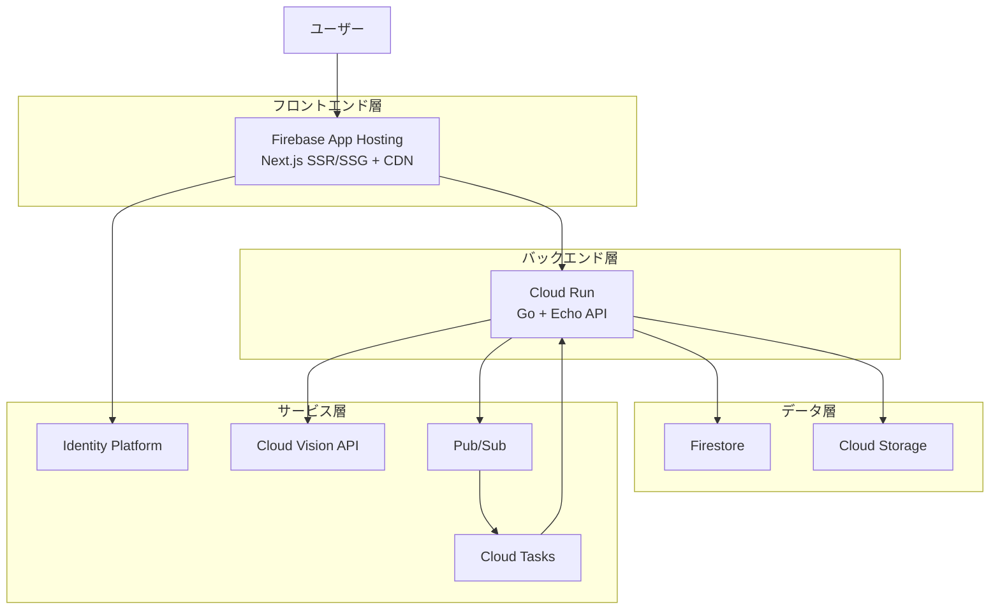

# 技術設計書 - Ledger Muse

## Overview

Ledger Muse は、Google Cloud 上で動作する家計簿管理 Web アプリケーションです。個人利用から将来的な商用展開までをカバーする拡張可能なアーキテクチャを採用し、収支管理、レシート画像 OCR、ナレッジ管理（メモ・検索）機能を統合します。

**ユーザー**: 個人ユーザーが日常的な収支記録、レシート画像のアップロード、メモ追加、検索、集計レポートの確認を行います。将来的には商用プラン（マルチテナント、有料機能）への拡張を想定しています。

**影響**: 本プロジェクトは新規構築（greenfield）であり、既存システムの変更は伴いません。Google Cloud の各種マネージドサービスを活用し、低コストで開始しつつ、将来的な商用運用に対応できる設計を実現します。

### Goals

- Google Cloud 上で動作する家計簿 Web アプリの構築（認証、収支管理、レシート OCR、メモ・検索機能）
- Hexagonal Architecture による保守性・拡張性の高い設計
- **学習目的かつ低コスト運用（月額 $0〜$1、ほぼ完全無料）**
- 将来的な商用運用への移行可能性（Firestore → Cloud SQL PostgreSQL、マルチテナント対応）
- Terraform による Infrastructure as Code（dev/staging/prod 環境分離）
- **Firebase App Hosting による Next.js 最適化デプロイ**

### Non-Goals

- 本設計フェーズでの実装コード作成（設計のみ）
- 銀行 API 連携や AI による高度な分析機能（将来拡張として記載）
- モバイルアプリ（iOS/Android ネイティブ）の開発（Web レスポンシブ対応のみ）
- リアルタイム協調編集機能（将来的な商用機能として検討）

---

## 📁 設計ドキュメント構成

本技術設計書は、以下のドキュメントに分割されています。各ドキュメントで詳細を確認してください。

| ドキュメント | 内容 | リンク |
|-------------|------|--------|
| **アーキテクチャ設計** | アーキテクチャパターン、技術スタック、コスト試算、パフォーマンス目標 | [design/architecture.md](design/architecture.md) |
| **システムフロー** | 認証フロー、レシートOCRフロー、検索フロー（シーケンス図） | [design/flows.md](design/flows.md) |
| **コンポーネント設計** | コンポーネント概要、レイヤー構成、API Contract、Event Contract | [design/components.md](design/components.md) |
| **データモデル** | ドメインモデル、ER図、Firestore物理モデル、PostgreSQL移行戦略 | [design/data-models.md](design/data-models.md) |
| **セキュリティ設計** | 脅威モデル、認証・認可、データ保護、エラーハンドリング | [design/security.md](design/security.md) |
| **テスト戦略** | Unit/Integration/E2E/Performance テスト、カバレッジ目標 | [design/testing.md](design/testing.md) |

---

## 技術スタック概要

### フロントエンド

- **フレームワーク**: Next.js 15.x (TypeScript)
- **ホスティング**: **Firebase App Hosting**（2025年4月GA、SSR/SSG最適化、CDN統合、無料枠10k訪問/月）
- **認証**: NextAuth.js (Auth.js) v5.x + Google Cloud Identity Platform
- **スタイリング**: Tailwind CSS（推奨）

### バックエンド

- **言語・フレームワーク**: Go 1.23.x + Echo v4.x
- **ホスティング**: Cloud Run
- **認証**: Firebase Admin SDK (Go) v4.x
- **アーキテクチャ**: Hexagonal Architecture（ポート＆アダプター）

### データベース

- **初期**: Firestore (Native Mode)（無料枠活用）
- **将来**: Cloud SQL PostgreSQL 16.x（段階的移行）

### ストレージ・OCR・非同期処理

- **画像ストレージ**: Cloud Storage
- **OCR**: Cloud Vision API
- **メッセージング**: Pub/Sub
- **非同期処理**: Cloud Tasks

### インフラ・CI/CD・監視

- **IaC**: Terraform v1.9.x（環境分離: dev/staging/prod）
- **CI/CD**: Cloud Build + GitHub Actions
- **監視**: Cloud Monitoring + Logging + Trace
- **セキュリティ**: Cloud Armor（将来導入）

**詳細**: [design/architecture.md](design/architecture.md)

---

## アーキテクチャ概要図

**詳細**: [design/architecture.md](design/architecture.md)

---

## 主要システムフロー

### 1. ユーザー認証フロー

NextAuth.js → Identity Platform → Backend API JWT検証

**詳細**: [design/flows.md#ユーザー認証フロー](design/flows.md#ユーザー認証フロー)

### 2. レシート画像アップロード & OCR 処理フロー

Frontend → Cloud Storage → Pub/Sub → Cloud Tasks → OCR Worker → Firestore

**詳細**: [design/flows.md#レシート画像アップロード--ocr-処理フロー](design/flows.md#レシート画像アップロード--ocr-処理フロー)

### 3. 取引検索フロー

Frontend → Backend API → Firestore クエリ + アプリケーション層フィルタリング

**詳細**: [design/flows.md#取引検索フロー](design/flows.md#取引検索フロー)

---

## 要件トレーサビリティ

| Requirement ID | Title | Components | API Endpoints | System Flows |
|----------------|-------|------------|---------------|--------------|
| 1 | ユーザー認証・アカウント管理 | AuthService, JWTMiddleware | POST /api/v1/auth/signup, /login, /logout | 認証フロー |
| 2 | 収支記録の登録・管理 | TransactionService | POST/GET/PUT/DELETE /api/v1/transactions | CRUD フロー |
| 3 | カテゴリ管理 | CategoryService | POST/GET/PUT/DELETE /api/v1/categories | - |
| 4 | レシート画像アップロード | ReceiptService, CloudStorageAdapter | POST /api/v1/receipts/upload | レシートアップロードフロー |
| 5 | レシート OCR 処理 | OCRWorker, CloudVisionAdapter | - | レシート OCR 処理フロー |
| 6 | ナレッジ管理（メモ機能） | KnowledgeService | POST/GET/PUT/DELETE /api/v1/transactions/{id}/memos | - |
| 7 | 検索機能 | SearchService | GET /api/v1/transactions/search | 取引検索フロー |
| 8 | 集計・レポート機能 | TransactionService | GET /api/v1/reports/summary | - |
| 9 | データベース設計・管理 | FirestoreAdapter | - | 全フロー |
| 10 | API 設計 | Echo Router | 全エンドポイント | 全フロー |
| 11 | セキュリティ・認可 | JWTMiddleware | - | 認証フロー |
| 12 | インフラストラクチャ | Terraform Modules | - | 全フロー |
| 13 | フロントエンド UI/UX | Next.js App (Firebase App Hosting) | - | 全フロー |
| 14 | 拡張性・将来対応 | マルチテナント設計 | - | - |
| 15 | 運用・監視 | MonitoringService | GET /health | - |
| 16 | 技術選定基準 | - | - | - |
| 17 | Terraform IaC | Terraform Modules | - | - |
| 18 | 非同期処理アーキテクチャ | Pub/Sub, Cloud Tasks | - | レシート OCR フロー |
| 19 | データ暗号化 | Cloud KMS, TLS | - | 全フロー |
| 20 | パフォーマンス・KPI | MonitoringService | - | - |
| 21 | コスト管理・最適化 | Billing Export | - | - |

---

## コスト試算（個人利用）

### 月額コスト見積もり

| サービス | 無料枠 | 個人利用想定 | 月額コスト |
|---------|--------|--------------|-----------|
| Firebase App Hosting | 10,000訪問/月 | 〜1,000訪問/月 | **$0** |
| Cloud Run (Backend) | 200万リクエスト/月 | 〜5,000リクエスト/月 | **$0** |
| Firestore | 1GB、50k読み取り/日 | 〜100件取引 | **$0** |
| Cloud Storage | 5GB | 〜500MB | **$0** |
| Cloud Vision API | 1,000リクエスト/月 | 〜30枚/月 | **$0** |
| その他（Pub/Sub, Cloud Tasks, etc.） | 十分な無料枠 | 最小利用 | **$0** |

**合計月額コスト**: **$0〜$1**（ほぼ完全無料）

**詳細**: [design/architecture.md#コスト試算個人利用](design/architecture.md#コスト試算個人利用)

---

## パフォーマンス目標

- **API レスポンスタイム**: 95 パーセンタイル < 1 秒
- **OCR 処理時間**: 平均 < 15 秒、最大 < 30 秒
- **ページ読み込み時間**: LCP < 2.5 秒
- **エラーレート**: < 1%
- **システム稼働率**: 99.5% 以上（学習段階）、99.9% 以上（商用段階）

**詳細**: [design/architecture.md#パフォーマンス・スケーラビリティ](design/architecture.md#パフォーマンス・スケーラビリティ)

---

## セキュリティ対策

- **認証**: Google Cloud Identity Platform + JWT
- **データ保護**: HTTPS (TLS 1.3)、Cloud Storage暗号化、Firestore暗号化
- **脅威対策**: XSS防止（DOMPurify）、CSRF保護（NextAuth.js）
- **ログ管理**: 構造化ログ、機密情報マスキング

**詳細**: [design/security.md](design/security.md)

---

## テスト戦略

- **Unit Tests**: Go + TypeScript、コードカバレッジ 80% 以上
- **Integration Tests**: Firestore エミュレーター使用
- **E2E Tests**: Playwright、クリティカルパス 100% カバー
- **Performance Tests**: JMeter / Locust

**詳細**: [design/testing.md](design/testing.md)

---

## データモデル

### ドメインエンティティ

- User, Transaction, Category, Receipt, Memo

### Firestoreコレクション構造

- `users/{userId}`
- `users/{userId}/transactions/{transactionId}`
- `users/{userId}/categories/{categoryId}`
- `receipts/{receiptId}`
- `users/{userId}/memos/{memoId}`

**詳細**: [design/data-models.md](design/data-models.md)

---

## PostgreSQL 移行戦略

### 3段階移行アプローチ

1. **Phase 1**: JSONB Storage（Firestoreデータをそのまま保存）
2. **Phase 2**: Extract Critical Fields（重要フィールドをカラム化）
3. **Phase 3**: Full Relational Normalization（完全正規化）

**詳細**: [design/data-models.md#future-postgresql-migration-strategy](design/data-models.md#future-postgresql-migration-strategy)

---

## 次のステップ

1. **設計レビュー**: 各設計ドキュメントをレビュー
2. **設計承認**: `/kiro:validate-design household-finance-app` で品質チェック
3. **タスク生成**: `/kiro:spec-tasks household-finance-app -y` で実装タスク生成
4. **実装開始**: Spec-Driven Developmentで実装フェーズへ

---

## 参考資料

- **要件定義書**: [../requirements.md](requirements.md)
- **調査記録**: [../research.md](research.md)
- **プロジェクトメタデータ**: [../spec.json](spec.json)
