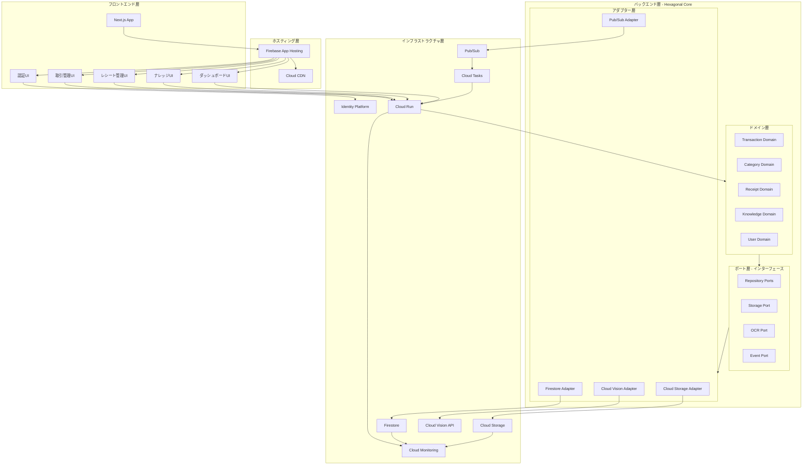

# アーキテクチャ設計

## Architecture Pattern & Boundary Map

**選択パターン**: Hexagonal Architecture（ポート＆アダプター）+ Clean Architecture の概念

**ドメイン境界**:
- **Transactions（取引）**: 収入・支出の記録、編集、削除、集計
- **Categories（カテゴリ）**: カテゴリの作成、編集、削除、取引への関連付け
- **Receipts（レシート）**: 画像アップロード、OCR 処理、結果の関連付け
- **Knowledge（ナレッジ）**: メモ追加、タグ管理、検索機能
- **Users（ユーザー）**: 認証、アカウント管理、権限制御

**ポート（インターフェース）**:
- Repository ポート: TransactionRepository, CategoryRepository, ReceiptRepository, KnowledgeRepository, UserRepository
- Storage ポート: ImageStorage
- OCR ポート: OCRService
- Event ポート: EventPublisher

**アダプター（実装）**:
- Firestore アダプター: 各 Repository の Firestore 実装
- Cloud Storage アダプター: ImageStorage の Cloud Storage 実装
- Cloud Vision アダプター: OCRService の Cloud Vision API 実装
- Pub/Sub アダプター: EventPublisher の Pub/Sub 実装

**新規コンポーネントの根拠**:
- Hexagonal Architecture により、ドメインロジックとインフラストラクチャを分離
- 将来的な Firestore → PostgreSQL 移行時にアダプターのみ交換可能
- テスト容易性向上（モックポートで単体テスト）

**Steering 準拠**: 学習目的かつ将来的な商用化を見据えた設計、安定技術の採用、コスト管理

## システムアーキテクチャ図

## Technology Stack

| Layer | Choice / Version | Role in Feature | Notes |
|-------|------------------|-----------------|-------|
| **Frontend** | Next.js 15.x (TypeScript) | Web UI, SSR/SSG, API Routes | App Router 使用、レスポンシブデザイン対応 |
| **Frontend Hosting** | Firebase App Hosting | Next.js SSR/SSG 最適化、CDN 統合 | 2025年4月GA、GitHub CI/CD統合、無料枠10k訪問/月 |
| **Frontend Auth** | NextAuth.js (Auth.js) v5.x | Google OAuth 認証、セッション管理 | Identity Platform 統合、JWT セッション |
| **Backend** | Go 1.23.x + Echo v4.x | REST API、ビジネスロジック | Cloud Run デプロイ、Hexagonal Architecture 実装 |
| **Backend Auth** | Firebase Admin SDK (Go) v4.x | JWT トークン検証 | echo-middleware-firebasejwt 使用 |
| **Database (初期)** | Firestore (Native Mode) | ドキュメントストア | 無料枠活用、将来的に PostgreSQL 移行 |
| **Database (将来)** | Cloud SQL PostgreSQL 16.x | リレーショナル DB | JSONB サポート、ACID トランザクション |
| **Storage** | Cloud Storage Standard Class | レシート画像保存 | サーバー側暗号化、ライフサイクルポリシー |
| **OCR** | Cloud Vision API | レシート OCR 処理 | DOCUMENT_TEXT_DETECTION モード |
| **Messaging** | Pub/Sub | イベント駆動アーキテクチャ | receipt.uploaded イベント発行 |
| **Async Processing** | Cloud Tasks | OCR ワーカー管理 | レート制限、リトライ制御 |
| **Infrastructure** | Terraform v1.9.x | IaC、環境分離 | dev/staging/prod 分離管理 |
| **CI/CD** | Cloud Build + GitHub Actions | 自動ビルド・デプロイ | ユニットテスト・E2E テスト自動実行 |
| **Monitoring** | Cloud Monitoring + Logging + Trace | メトリクス収集、ログ管理、トレース | 構造化ログ（JSON）、分散トレーシング |
| **Security** | Cloud Armor (将来) | WAF、DDoS 対策 | 商用運用時に導入 |

**選定根拠**:
- **Next.js**: 2025 年時点で最も人気のある React フレームワーク、TypeScript フルサポート、SSR/SSG による SEO 対応
- **Firebase App Hosting**: 2025年4月GA、Next.js専用最適化、CDN統合、GitHub CI/CD、個人利用なら無料枠内（10k訪問/月）
- **Echo**: Go の Web フレームワークで 16% の採用率、Gin より構造化されており中規模 API に適合
- **Firestore → PostgreSQL**: 学習段階では低コスト（無料枠）、将来的にリレーショナル機能（複雑な JOIN、トランザクション）が必要になった際に移行
- **Pub/Sub + Cloud Tasks**: イベント駆動（拡張性）とレート制御（Vision API クォータ管理）の両立
- **Terraform**: 2025 年のベストプラクティスは環境別ディレクトリ分離（ワークスペースではなく）

詳細な技術調査、代替案の比較、ベンチマーク結果は `research.md` の「Architecture Pattern Evaluation」および「Design Decisions」セクションを参照してください。

## コスト試算（個人利用）

### 月額コスト見積もり

| サービス | 無料枠 | 個人利用想定 | 月額コスト |
|---------|--------|--------------|-----------|
| **Firebase App Hosting** | 10,000訪問/月 | 〜1,000訪問/月 | $0 |
| **Cloud Run (Backend)** | 200万リクエスト/月、180k vCPU秒/月 | 〜5,000リクエスト/月 | $0 |
| **Firestore** | 1GB、50k読み取り/日、20k書き込み/日 | 〜100件取引、数百操作/日 | $0 |
| **Cloud Storage** | 5GB（USリージョン） | 〜500MB（月30枚×2MB×12ヶ月） | $0 |
| **Cloud Vision API** | 1,000リクエスト/月 | 〜30枚/月 | $0 |
| **Pub/Sub** | 10GiB/月 | 〜1MB/月 | $0 |
| **Cloud Tasks** | 100万オペレーション/月 | 〜30オペレーション/月 | $0 |
| **Identity Platform** | 50,000 MAU | 1 MAU | $0 |
| **Cloud Build** | 120分/日 | 〜10分/日 | $0 |
| **Artifact Registry** | 0.5GB | 〜0.3GB（Goバイナリ小） | $0 |

**合計月額コスト**: **$0〜$1**（ほぼ完全無料）

### コスト最適化ポイント
1. Firebase App Hostingの無料枠（10k訪問/月）は個人利用に十分
2. Cloud Runは無料枠が非常に大きい（200万リクエスト/月）
3. Firestoreの無料枠（1GB、50k読み取り/日）で数千件の取引を管理可能
4. レシート画像はCloud Storageのライフサイクルポリシーで古い画像を自動削除（コスト削減）
5. 開発環境のみで開始し、必要に応じてstaging/prod環境を追加

## パフォーマンス・スケーラビリティ

### Target Metrics

- **API レスポンスタイム**: 95 パーセンタイル < 1 秒（Cloud Monitoring で計測）
- **OCR 処理時間**: 平均 < 15 秒、最大 < 30 秒（Cloud Tasks のタスク実行時間で計測）
- **ページ読み込み時間**: LCP < 2.5 秒（Lighthouse CI で計測）
- **エラーレート**: < 1%（Cloud Monitoring で計測）
- **システム稼働率**: 99.5% 以上（学習段階）、99.9% 以上（商用段階）

### Scaling Approaches

- **Horizontal Scaling**: Cloud Run の自動スケーリング（min: 0, max: 10 インスタンス、学習段階）
- **Vertical Scaling**: Cloud Run のインスタンスサイズ調整（1 vCPU, 512 MB → 2 vCPU, 1 GB）
- **Database Scaling**: Firestore の自動スケーリング（書き込みスループット制限に注意）
- **Storage Scaling**: Cloud Storage の自動スケーリング（容量制限なし）
- **Frontend Scaling**: Firebase App Hostingの自動スケーリング（Cloud CDN統合）

### Caching Strategies

- **CDN キャッシング**: Firebase App Hostingが自動的にCloud CDNを統合（静的アセット、SSGページ）
- **アプリケーションキャッシング**: 将来的に Memorystore (Redis) を導入（カテゴリ一覧、ユーザー情報）
- **クライアントキャッシング**: Next.js の ISR (Incremental Static Regeneration) で API レスポンスをキャッシュ
- **クエリ最適化**: Firestore の複合インデックス、ページネーション（limit + offset）
