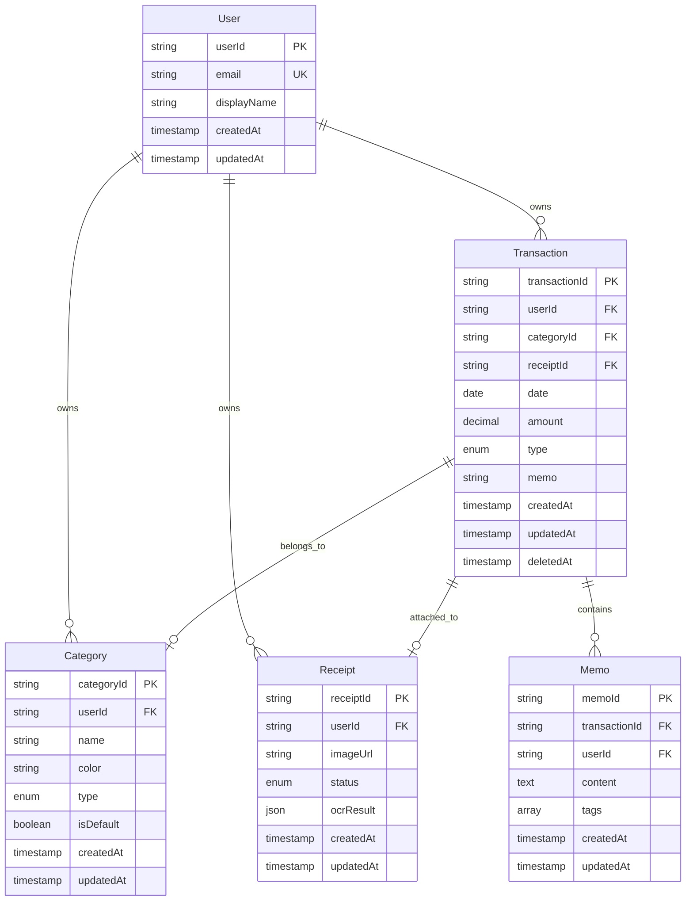

# データモデル設計

本ドキュメントでは、ドメインモデル、論理データモデル、物理データモデル（Firestore）、将来の PostgreSQL 移行を考慮したデータ構造を定義します。

## Domain Model

**Aggregates & Transactional Boundaries**:
- **Transaction Aggregate**: Transaction（集約ルート）、Memo（エンティティ）、Category（参照）
- **Category Aggregate**: Category（集約ルート）
- **Receipt Aggregate**: Receipt（集約ルート）、OCRResult（値オブジェクト）
- **User Aggregate**: User（集約ルート）

**Entities, Value Objects, Domain Events**:
- **Entities**: Transaction, Category, Receipt, User, Memo
- **Value Objects**: OCRResult, Money (amount + currency), DateRange
- **Domain Events**: ReceiptUploaded, OCRCompleted, TransactionCreated

**Business Rules & Invariants**:
- Transaction の amount は正の数値（0 < amount）
- Transaction は必ず Category に紐付く（categoryId が存在）
- Category を削除する場合、該当カテゴリを使用する Transaction が存在しないこと
- Receipt の status は PENDING → PROCESSING → COMPLETED または FAILED の順に遷移
- User は一意のメールアドレスを持つ

## ER図



## Logical Data Model

**Structure Definition**:
- **User**: ユーザー情報（1 ユーザー = 1 レコード）
- **Transaction**: 取引レコード（1 取引 = 1 レコード）、userId および categoryId で外部キー参照
- **Category**: カテゴリレコード（1 カテゴリ = 1 レコード）、userId で外部キー参照
- **Receipt**: レシートレコード（1 レシート = 1 レコード）、userId で外部キー参照
- **Memo**: メモレコード（1 メモ = 1 レコード）、transactionId および userId で外部キー参照

**Entity Relationships and Cardinality**:
- User : Transaction = 1 : N
- User : Category = 1 : N
- User : Receipt = 1 : N
- Transaction : Category = N : 1
- Transaction : Receipt = N : 1（1 つの Receipt に複数の Transaction が関連付け可能）
- Transaction : Memo = 1 : N

**Attributes and Their Types**:
- userId: string (UUID)
- email: string (最大 255 文字)
- amount: decimal (精度 10 桁、小数点以下 2 桁)
- date: date (ISO 8601 形式: YYYY-MM-DD)
- type: enum ('INCOME', 'EXPENSE')
- status: enum ('PENDING', 'PROCESSING', 'COMPLETED', 'FAILED')
- color: string (Hex カラーコード: #RRGGBB)
- tags: array of string (最大 10 個)

**Referential Integrity Rules**:
- Transaction.userId → User.userId (CASCADE DELETE: User 削除時に関連 Transaction も削除)
- Transaction.categoryId → Category.categoryId (RESTRICT DELETE: Category 削除時に関連 Transaction が存在する場合は削除不可)
- Transaction.receiptId → Receipt.receiptId (SET NULL: Receipt 削除時に Transaction.receiptId を NULL に設定)
- Memo.transactionId → Transaction.transactionId (CASCADE DELETE: Transaction 削除時に関連 Memo も削除)

## Physical Data Model (Firestore)

Firestore はドキュメント指向 NoSQL のため、コレクション構造で設計します。

**Collection Structures**:
- `users/{userId}` コレクション: ユーザー情報
- `users/{userId}/transactions/{transactionId}` サブコレクション: 取引レコード
- `users/{userId}/categories/{categoryId}` サブコレクション: カテゴリレコード
- `receipts/{receiptId}` コレクション: レシートレコード（userId フィールドで参照）
- `users/{userId}/memos/{memoId}` サブコレクション: メモレコード（transactionId フィールドで参照）

**Index Definitions**:
- `users/{userId}/transactions/{transactionId}` に複合インデックス: `(userId, date DESC)`
- `users/{userId}/transactions/{transactionId}` に複合インデックス: `(userId, categoryId, date DESC)`
- `receipts/{receiptId}` に複合インデックス: `(userId, status, createdAt DESC)`
- `users/{userId}/memos/{memoId}` に複合インデックス: `(userId, transactionId, createdAt DESC)`

**Example Firestore Document Structures**:

```json
// users/{userId}
{
  "userId": "user_12345",
  "email": "user@example.com",
  "displayName": "John Doe",
  "createdAt": "2025-11-17T00:00:00Z",
  "updatedAt": "2025-11-17T00:00:00Z"
}

// users/{userId}/transactions/{transactionId}
{
  "transactionId": "txn_67890",
  "userId": "user_12345",
  "date": "2025-11-15",
  "amount": 1200.50,
  "type": "EXPENSE",
  "categoryId": "cat_111",
  "categoryName": "食費",
  "categoryColor": "#FF5733",
  "memo": "スーパーで買い物",
  "receiptId": "receipt_222",
  "createdAt": "2025-11-15T10:30:00Z",
  "updatedAt": "2025-11-15T10:30:00Z",
  "deletedAt": null
}

// receipts/{receiptId}
{
  "receiptId": "receipt_222",
  "userId": "user_12345",
  "imageUrl": "https://storage.googleapis.com/ledger-muse-receipts/users/user_12345/receipts/receipt_222.jpg",
  "status": "COMPLETED",
  "ocrResult": {
    "amount": 1200.50,
    "date": "2025-11-15",
    "merchantName": "スーパーマーケットA",
    "confidence": 0.92,
    "rawText": "スーパーマーケットA\n2025/11/15\n合計 ¥1,200\n..."
  },
  "createdAt": "2025-11-15T10:25:00Z",
  "updatedAt": "2025-11-15T10:30:00Z"
}
```

## Future PostgreSQL Migration Strategy

### Phase 1: JSONB Storage

- `transactions`, `categories`, `receipts`, `memos` テーブルを作成
- 各テーブルに `id` (UUID), `data` (JSONB) カラムを持つ
- Firestore ドキュメントを JSONB 形式でそのまま保存

### Phase 2: Extract Critical Fields

- `transactions` テーブルに `user_id`, `date`, `amount`, `type`, `category_id` カラムを追加
- Firestore の該当フィールドを抽出してカラムに格納
- GIN インデックスを `data` カラムに作成（JSONB クエリ最適化）

### Phase 3: Full Relational Normalization

- 正規化テーブル構造（users, transactions, categories, receipts, memos）に完全移行
- 外部キー制約、チェック制約、トリガーを追加
- ACID トランザクション、複雑な JOIN クエリ、集計関数の活用

**Migration Tools**:
- Google Cloud Database Migration Service
- カスタム Go スクリプトで Firestore → PostgreSQL データエクスポート
- Terraform で PostgreSQL インスタンス、データベース、スキーマを管理

**詳細は**: `../design.md` の「Migration Strategy」セクションを参照
