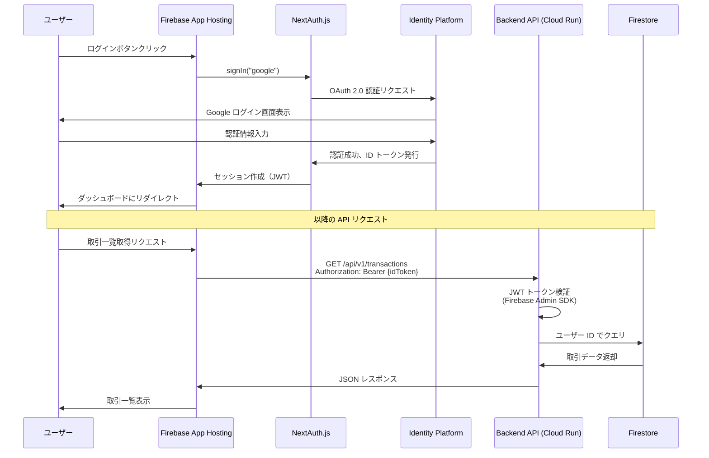
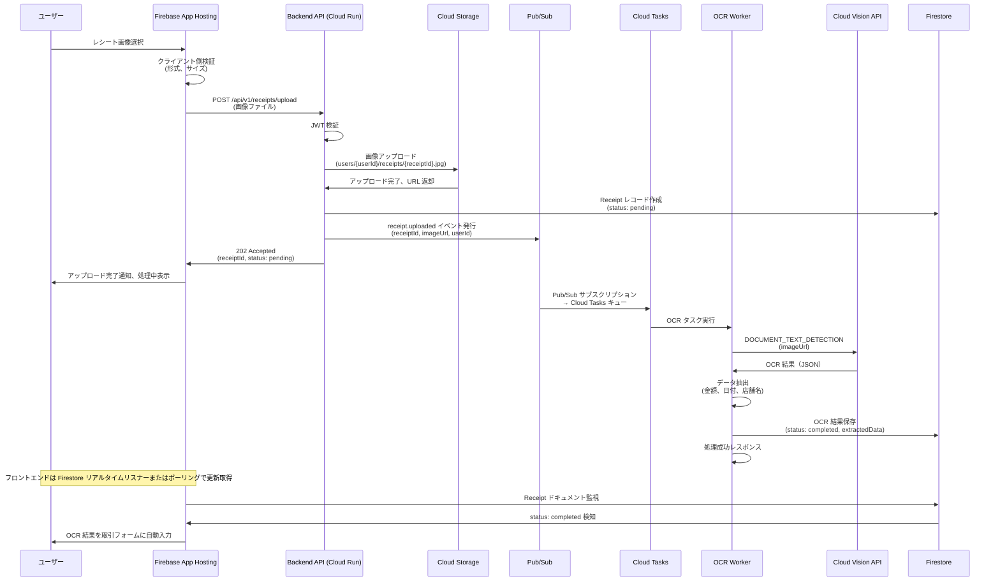
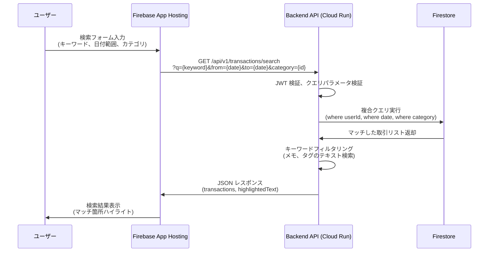

# システムフロー設計

本ドキュメントでは、主要なシステムフローをシーケンス図で定義します。

## ユーザー認証フロー

**フロー決定事項**:
- NextAuth.js が OAuth フロー、セッション管理を担当
- ID トークンは Authorization ヘッダーで Backend API に送信
- Backend は Firebase Admin SDK でトークン検証、ユーザー ID 抽出
- セッションは JWT 形式で保存（デフォルト 30 日間有効）

## レシート画像アップロード & OCR 処理フロー

**フロー決定事項**:
- 非同期処理により API レスポンスタイムを短縮（30 秒以内の OCR 処理時間を非ブロッキング化）
- Pub/Sub でイベント発行（将来的にサムネイル生成などの追加サブスクライバーを容易に追加可能）
- Cloud Tasks でレート制限（Vision API クォータ管理）
- Firestore リアルタイムリスナーで UI 更新（WebSocket 不要）
- OCR 失敗時はデッドレターキューに移動、アラート発報

## 取引検索フロー

**フロー決定事項**:
- Firestore の複合インデックスで日付・カテゴリフィルタを高速化
- テキスト検索（キーワード）はアプリケーション層で実装（Firestore はフルテキスト検索非対応）
- 将来的に BigQuery へのデータエクスポートで高度な検索・分析機能を追加可能
