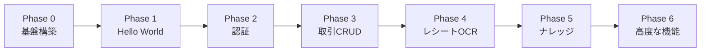

# 実装戦略

本ドキュメントでは、Ledger Muse の段階的な実装アプローチと戦略を定義します。

## 実装アプローチ: Walking Skeleton

### Walking Skeleton とは

**Walking Skeleton**（歩く骨格）は、システムの最小限の機能を早期に実装し、エンドツーエンドで動作する状態を作るアプローチです。

### 採用理由

1. **早期リスク検出**: インフラ、デプロイ、統合の問題を早期に発見
2. **継続的フィードバック**: 各フェーズで動作確認可能な状態を維持
3. **品質の早期確立**: CI/CD、Lint、TypeCheckを最初に構築し、以降の開発で品質を維持
4. **学習曲線の緩和**: 新技術（Firebase App Hosting、Cloud Run等）を段階的に習得

### 実装フェーズの全体像



---

## Phase 0: プロジェクト基盤構築

### 目的

CI/CD パイプラインと品質ゲートを構築し、以降の開発で自動化された品質保証を実現する。

### 実装タスク

#### 1. リポジトリセットアップ

- [x] モノレポ構造の作成（`frontend/`, `backend/`, `terraform/`）
- [ ] `.gitignore` 設定
- [ ] `README.md` 作成

#### 2. Frontend セットアップ

- [ ] Next.js 15 プロジェクト初期化（TypeScript）
- [ ] ESLint + Prettier 設定
- [ ] Vitest + React Testing Library 設定
- [ ] Tailwind CSS セットアップ
- [ ] `package.json` スクリプト定義:
  ```json
  {
    "scripts": {
      "dev": "next dev",
      "build": "next build",
      "start": "next start",
      "lint": "next lint",
      "type-check": "tsc --noEmit",
      "test": "vitest run",
      "test:watch": "vitest"
    }
  }
  ```

#### 3. Backend セットアップ

- [ ] Go プロジェクト初期化（`go mod init`）
- [ ] Echo フレームワーク導入
- [ ] golangci-lint 設定（`.golangci.yml`）
- [ ] ディレクトリ構造作成（Hexagonal Architecture）:
  ```
  backend/
  ├── cmd/
  │   └── api/
  │       └── main.go
  ├── internal/
  │   ├── domain/          # ドメイン層
  │   ├── application/     # アプリケーション層
  │   ├── adapter/         # アダプター層
  │   └── port/            # ポート定義
  ├── pkg/                 # 共通パッケージ
  └── Dockerfile
  ```

#### 4. CI/CD パイプライン構築

- [ ] GitHub Actions ワークフロー作成:
  - [ ] `.github/workflows/quality-gate.yml`（Lint、TypeCheck、Test、Build）
  - [ ] `.github/workflows/deploy-backend.yml`（Cloud Run デプロイ）
- [ ] Firebase App Hosting の GitHub 統合設定
- [ ] ブランチ保護ルール設定（`main`, `develop`）

#### 5. Terraform セットアップ

- [ ] Terraform プロジェクト初期化
- [ ] リモートステート設定（Cloud Storage）
- [ ] 環境分離（`terraform/environments/staging`, `prod`）※ローカル開発はGCP不要
- [ ] 基本モジュール作成:
  - [ ] `modules/cloud-run`
  - [ ] `modules/firestore`
  - [ ] `modules/storage`

#### 6. ローカル開発環境セットアップ

**重要**: ローカル開発ではGCPへのデプロイは行わず、エミュレーターを使用します。

##### Firebase Emulator Suite

- [ ] Firebase CLI インストール: `npm install -g firebase-tools`
- [ ] Firebase プロジェクト初期化: `firebase init emulators`
- [ ] エミュレーター設定（`firebase.json`）:
  ```json
  {
    "emulators": {
      "auth": { "port": 9099 },
      "firestore": { "port": 8080 },
      "storage": { "port": 9199 },
      "pubsub": { "port": 8085 },
      "ui": { "enabled": true, "port": 4000 }
    }
  }
  ```

##### 環境変数設定

- [ ] フロントエンド（`.env.local`）:
  ```bash
  NEXT_PUBLIC_API_URL=http://localhost:8080
  NEXT_PUBLIC_FIRESTORE_EMULATOR_HOST=localhost:8080
  NEXT_PUBLIC_AUTH_EMULATOR_HOST=localhost:9099
  NEXTAUTH_URL=http://localhost:3000
  NEXTAUTH_SECRET=your-development-secret
  ```

- [ ] バックエンド（`.env`）:
  ```bash
  ENV=local
  FIRESTORE_EMULATOR_HOST=localhost:8080
  FIREBASE_AUTH_EMULATOR_HOST=localhost:9099
  STORAGE_EMULATOR_HOST=localhost:9199
  PUBSUB_EMULATOR_HOST=localhost:8085
  GCP_PROJECT_ID=demo-project
  ```

##### Docker Compose（オプション）

- [ ] `docker-compose.yml` 作成（バックエンド＋エミュレーター統合）
- [ ] 一括起動スクリプト作成: `docker-compose up`

##### Cloud Vision API モック

- [ ] モックOCRサービス実装（ローカル開発用）:
  ```go
  func NewOCRService() OCRService {
      if os.Getenv("ENV") == "local" {
          return &MockOCRService{}
      }
      return &CloudVisionAdapter{}
  }
  ```

##### 起動確認

- [ ] `firebase emulators:start` でエミュレーター起動
- [ ] `cd backend && go run cmd/api/main.go` でバックエンド起動
- [ ] `cd frontend && npm run dev` でフロントエンド起動
- [ ] http://localhost:3000 でアクセス確認
- [ ] http://localhost:4000 でFirestore UIアクセス確認

### 成功基準

- [ ] CI パイプラインがすべて成功する（Green Build）
- [ ] `main` ブランチへのマージには品質ゲートが必須
- [ ] Terraform で基本リソースをデプロイ可能
- [ ] **ローカル開発環境が正常に動作する**:
  - [ ] Firebaseエミュレーターが起動する
  - [ ] Frontend（localhost:3000）にアクセスできる
  - [ ] Backend（localhost:8080/health）が応答する
  - [ ] Firestore UI（localhost:4000）でデータ確認できる

---

## Phase 1: Hello World デプロイ

### 目的

フロントエンドとバックエンドを最小限の機能で実装し、**まずローカル環境で動作確認後**、Staging環境へデプロイしてエンドツーエンドの接続を確認する。

### 実装タスク

#### Frontend

- [ ] トップページ作成（`app/page.tsx`）:
  ```tsx
  export default function Home() {
    return <h1>Ledger Muse - Hello World</h1>
  }
  ```
- [ ] **ローカル環境で動作確認**: `npm run dev` → http://localhost:3000
- [ ] Firebase App Hosting へデプロイ
- [ ] Staging環境で動作確認

#### Backend

- [ ] ヘルスチェックエンドポイント実装:
  ```go
  // GET /health
  func HealthCheck(c echo.Context) error {
    return c.JSON(200, map[string]string{
      "status": "ok",
      "version": "0.1.0",
    })
  }
  ```
- [ ] **ローカル環境で動作確認**: `go run cmd/api/main.go` → http://localhost:8080/health
- [ ] Dockerfile 作成
- [ ] Cloud Run へデプロイ
- [ ] Staging環境で動作確認（`curl https://api-staging.example.com/health`）

#### 統合確認

- [ ] **ローカル環境**: Frontend（localhost:3000）から Backend（localhost:8080）を呼び出し:
  ```tsx
  // app/page.tsx
  const res = await fetch(`${process.env.NEXT_PUBLIC_API_URL}/health`)
  const data = await res.json()
  ```
- [ ] **ローカル環境**: CORS 設定確認
- [ ] **Staging環境**: Frontend（Firebase App Hosting）から Backend（Cloud Run）を呼び出し
- [ ] **PR Preview環境**: プレビューURLから動作確認

### 成功基準

- [ ] **ローカル環境でFrontend/Backendが連携できる**
- [ ] Frontend が Firebase App Hosting（Staging）で公開されている
- [ ] Backend が Cloud Run（Staging）で公開されている
- [ ] Frontend から Backend API を呼び出せる
- [ ] すべてのCI/CDパイプラインが成功している

---

## Phase 2: 認証機能実装

### 目的

Google Cloud Identity Platform + NextAuth.js による認証機能を実装し、保護されたルートを作成する。

### 実装タスク

#### Frontend

- [ ] NextAuth.js v5 セットアップ
- [ ] Google Provider 設定
- [ ] ログインページ作成（`app/login/page.tsx`）
- [ ] 認証状態管理（Session Provider）
- [ ] 保護されたルート作成（`app/dashboard/page.tsx`）

#### Backend

- [ ] Firebase Admin SDK セットアップ
- [ ] JWT ミドルウェア実装:
  ```go
  func JWTMiddleware(next echo.HandlerFunc) echo.HandlerFunc {
    return func(c echo.Context) error {
      token := extractToken(c.Request())
      decodedToken, err := verifyToken(token)
      if err != nil {
        return c.JSON(401, map[string]string{"error": "Unauthorized"})
      }
      c.Set("userId", decodedToken.UID)
      return next(c)
    }
  }
  ```
- [ ] 保護されたエンドポイント作成:
  ```go
  // GET /api/v1/me
  func GetCurrentUser(c echo.Context) error {
    userId := c.Get("userId").(string)
    return c.JSON(200, map[string]string{"userId": userId})
  }
  ```

#### Infrastructure

- [ ] Terraform で Identity Platform を有効化
- [ ] OAuth 2.0 クライアント設定

### 成功基準

- [ ] ユーザーが Google アカウントでログインできる
- [ ] ログイン後、ダッシュボードページにアクセスできる
- [ ] Backend API が JWT トークンを検証し、userId を抽出できる
- [ ] 未認証ユーザーは保護されたルートにアクセスできない（401エラー）

---

## Phase 3: 取引CRUD機能実装

### 目的

基本的な取引（Transaction）の作成・読み取り・更新・削除機能を実装する。

### 実装タスク

#### Domain Layer (Backend)

- [ ] ドメインエンティティ定義:
  ```go
  type Transaction struct {
    ID          string
    UserID      string
    Amount      float64
    Type        string // "income" or "expense"
    CategoryID  string
    Date        time.Time
    Description string
    CreatedAt   time.Time
    UpdatedAt   time.Time
  }
  ```
- [ ] Repository Port 定義（`port/transaction_repository.go`）
- [ ] Transaction Service 実装（`application/transaction_service.go`）

#### Adapter Layer (Backend)

- [ ] Firestore Adapter 実装:
  ```go
  // adapter/firestore/transaction_repository.go
  func (r *TransactionRepository) Create(ctx context.Context, tx *domain.Transaction) error {
    doc := r.client.Collection("users").Doc(tx.UserID).
                    Collection("transactions").NewDoc()
    _, err := doc.Set(ctx, tx)
    return err
  }
  ```

#### API Layer (Backend)

- [ ] REST API エンドポイント実装:
  - [ ] `POST /api/v1/transactions`
  - [ ] `GET /api/v1/transactions`
  - [ ] `GET /api/v1/transactions/:id`
  - [ ] `PUT /api/v1/transactions/:id`
  - [ ] `DELETE /api/v1/transactions/:id`

#### Frontend

- [ ] 取引一覧ページ作成（`app/transactions/page.tsx`）
- [ ] 取引作成フォーム（`app/transactions/new/page.tsx`）
- [ ] 取引編集フォーム（`app/transactions/[id]/edit/page.tsx`）
- [ ] API クライアント実装（`lib/api/transactions.ts`）

#### Testing

- [ ] Backend Unit Tests:
  - [ ] TransactionService のテスト
  - [ ] Firestore Adapter のテスト（エミュレーター使用）
- [ ] Frontend Unit Tests:
  - [ ] API クライアントのテスト（モック）
- [ ] E2E Tests:
  - [ ] 取引作成フロー（Playwright）
  - [ ] 取引一覧表示
  - [ ] 取引編集・削除

### 成功基準

- [ ] ユーザーが取引を作成できる
- [ ] 作成した取引が一覧ページに表示される
- [ ] 取引を編集・削除できる
- [ ] 他のユーザーの取引が表示されない（データ隔離）
- [ ] すべてのテストがパスする（Unit + E2E）

---

## Phase 4: レシートOCR機能実装

### 目的

レシート画像のアップロード、OCR処理、結果の取引フォームへの自動入力機能を実装する。

### 実装タスク

#### Backend - Receipt Service

- [ ] Receipt ドメインエンティティ定義
- [ ] Cloud Storage Adapter 実装
- [ ] Cloud Vision Adapter 実装
- [ ] Receipt Service 実装:
  - [ ] `POST /api/v1/receipts/upload`（画像アップロード → Pub/Sub イベント発行）

#### Backend - OCR Worker

- [ ] Pub/Sub サブスクリプション設定
- [ ] Cloud Tasks キュー設定
- [ ] OCR Worker 実装:
  ```go
  func ProcessReceipt(ctx context.Context, receiptID string) error {
    // 1. Cloud Storage から画像取得
    // 2. Cloud Vision API で OCR 実行
    // 3. 金額・日付・店舗名を抽出
    // 4. Firestore に結果を保存
  }
  ```

#### Frontend

- [ ] レシート画像アップロードフォーム作成
- [ ] OCR 処理状態の表示（ローディング、成功、失敗）
- [ ] OCR 結果の取引フォームへの自動入力

#### Infrastructure

- [ ] Terraform で Pub/Sub トピック作成
- [ ] Cloud Tasks キュー作成
- [ ] Cloud Vision API 有効化

#### Testing

- [ ] OCR Worker の Unit Tests（Cloud Vision API をモック）
- [ ] E2E Tests: レシートアップロード → OCR → 取引フォーム自動入力

### 成功基準

- [ ] レシート画像をアップロードできる
- [ ] OCR 処理が30秒以内に完了する
- [ ] 抽出された金額・日付が取引フォームに自動入力される
- [ ] OCR 失敗時にエラーメッセージが表示される

---

## Phase 5: ナレッジ機能（メモ・タグ）実装

### 目的

取引にメモとタグを追加し、検索機能を実装する。

### 実装タスク

#### Backend

- [ ] Memo ドメインエンティティ定義
- [ ] Memo Repository 実装
- [ ] Knowledge Service 実装:
  - [ ] `POST /api/v1/transactions/:id/memos`
  - [ ] `GET /api/v1/transactions/:id/memos`
  - [ ] `PUT /api/v1/memos/:id`
  - [ ] `DELETE /api/v1/memos/:id`

#### Frontend

- [ ] メモ追加フォーム（取引詳細ページ内）
- [ ] タグ入力コンポーネント（自動補完）
- [ ] Markdown プレビュー機能

#### Security

- [ ] XSS 対策: DOMPurify でサニタイズ処理

### 成功基準

- [ ] 取引にメモを追加できる
- [ ] Markdown 形式でメモを記述できる
- [ ] タグで取引を分類できる
- [ ] XSS 攻撃が防止されている

---

## Phase 6: 高度な機能（検索・レポート）実装

### 目的

検索機能と集計レポート機能を実装する。

### 実装タスク

#### Backend

- [ ] Search Service 実装:
  - [ ] `GET /api/v1/transactions/search?q=keyword&from=date&to=date&category=id`
  - [ ] Firestore 複合クエリ + アプリケーション層フィルタリング
- [ ] Report Service 実装:
  - [ ] `GET /api/v1/reports/summary?from=date&to=date`
  - [ ] 月次・カテゴリ別集計

#### Frontend

- [ ] 検索フォーム作成
- [ ] 検索結果表示（ハイライト機能）
- [ ] ダッシュボードのレポート表示（グラフ）

#### Testing

- [ ] 検索機能の E2E Tests
- [ ] レポート機能の Unit Tests

### 成功基準

- [ ] キーワード、日付範囲、カテゴリで取引を検索できる
- [ ] 検索結果にマッチ箇所がハイライト表示される
- [ ] ダッシュボードで月次・カテゴリ別集計が表示される

---

## リスク軽減戦略

### 技術リスク

| リスク | 影響 | 軽減策 |
|--------|------|--------|
| Firebase App Hosting が期待通り動作しない | High | Phase 1 で早期検証、必要なら Cloud Run へ移行 |
| OCR 精度が低い | Medium | Phase 4 で検証、手動修正機能を実装 |
| Firestore クエリのパフォーマンス問題 | Medium | 複合インデックス作成、必要なら PostgreSQL へ移行 |

### プロジェクトリスク

| リスク | 影響 | 軽減策 |
|--------|------|--------|
| 学習曲線による遅延 | Medium | Walking Skeleton で段階的に習得 |
| スコープクリープ | Low | 各フェーズの成功基準を明確化 |

---

## 実装優先順位の判断基準

1. **ビジネス価値**: ユーザーにとっての価値が高いか
2. **技術リスク**: 早期に検証すべき技術的不確実性があるか
3. **依存関係**: 他の機能の前提となるか

---

## 次のステップ

1. **Phase 0 から開始**: CI/CD と品質ゲートを構築
2. **各フェーズの成功基準を達成**: 動作確認可能な状態を維持
3. **継続的デプロイ**: Staging環境で常に最新状態を確認
4. **フィードバック収集**: 各フェーズ完了後に振り返り

---

## 参考資料

- [Walking Skeleton - Alistair Cockburn](https://wiki.c2.com/?WalkingSkeleton)
- [Test-Driven Development with Go](https://quii.gitbook.io/learn-go-with-tests/)
- [Next.js Testing Best Practices](https://nextjs.org/docs/app/building-your-application/testing)
